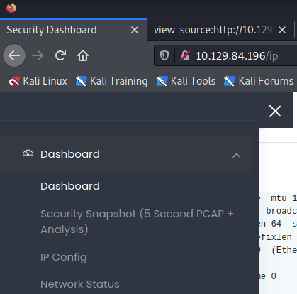
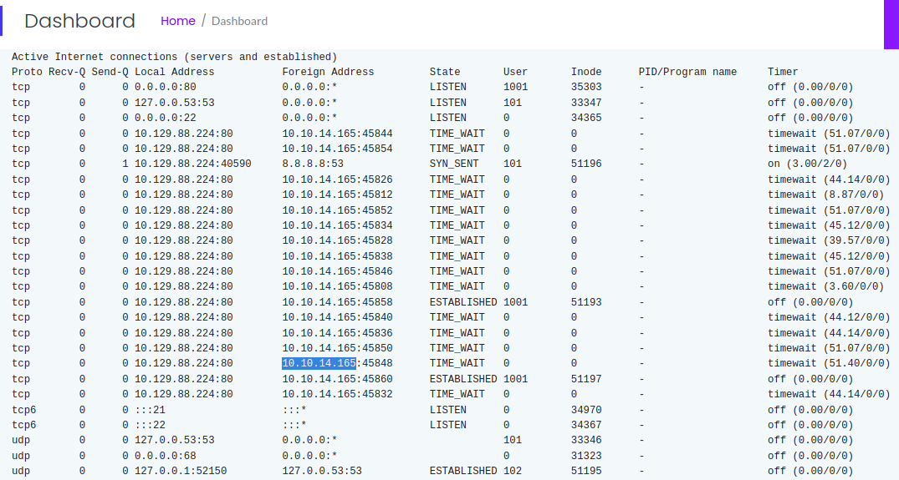

<button type="button" name="button" class="btn">#pcap</button>
<button type="button" name="button" class="btn">#vsftpd</button>
<button type="button" name="button" class="btn">#LFI</button>
<button type="button" name="button" class="btn">#SUID</button>

# Enumeration
Example of what is seen on the site. Appears to be nestat, IP Config, and some form of PCAP analysis pages via the menu. We also see that we're signed in as 'Nathan'.  
  
  


## Nmap Fast Scan:
```
nmap-fast $ip -Pn           
Starting Nmap 7.93 ( https://nmap.org ) at 2023-02-09 20:49 MST
Nmap scan report for 10.10.11.189
Host is up (0.083s latency).
Not shown: 65533 closed tcp ports (conn-refused)
PORT   STATE SERVICE
22/tcp open  ssh
80/tcp open  http
```

## Nmap Full Scan
```
nmap -sC -sV $ip -p22,80 -Pn
Starting Nmap 7.93 ( https://nmap.org ) at 2023-02-09 20:52 MST
Nmap scan report for 10.10.11.189
Host is up (0.059s latency).

PORT   STATE SERVICE VERSION
22/tcp open  ssh     OpenSSH 8.4p1 Debian 5+deb11u1 (protocol 2.0)
| ssh-hostkey: 
|   3072 845e13a8e31e20661d235550f63047d2 (RSA)
|   256 a2ef7b9665ce4161c467ee4e96c7c892 (ECDSA)
|_  256 33053dcd7ab798458239e7ae3c91a658 (ED25519)
80/tcp open  http    nginx 1.18.0
|_http-title: Did not follow redirect to http://precious.htb/
|_http-server-header: nginx/1.18.0
Service Info: OS: Linux; CPE: cpe:/o:linux:linux_kernel
```

"Did not follow redirect" prompted me to edit /etc/hosts and add an entry for previous.htb pointing to 10.10.11.189. Once complete, the scan results for 80 looked like this:
```
80/tcp open  http    nginx 1.18.0
|_http-title: Convert Web Page to PDF
| http-server-header: 
|   nginx/1.18.0
|_  nginx/1.18.0 + Phusion Passenger(R) 6.0.15
```

Navigating to the page, we're presented with this prompt:

