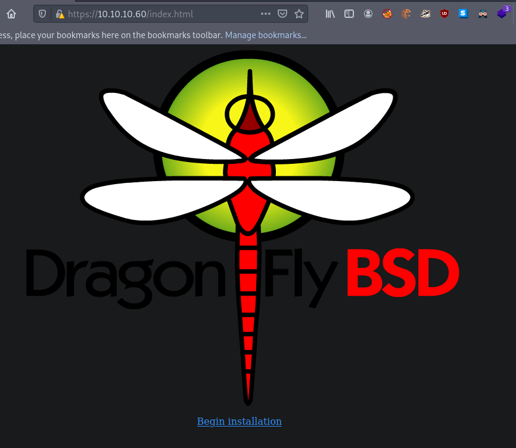

<button type="button" name="button" class="btn">#pfsense </button>
<button type="button" name="button" class="btn">#CVE-2014-4688</button>

# Lessons Learned
---
1. -k flag on gobuster allows for scanning of https sites with invalid certificates
2. Using more extensive wordlists can be critical to enumeration
	1. Including adding extensions like txt, php, etc
3. Need to get better at modifying existing pyhton scripts rather than relying on meterpreter when that isn't going my way

# Enumeration
---

## Nmap

```bash
─[us-vip-27]─[10.10.14.9]─[htb-ghohst@pwnbox-base]─[~]
└──╼ [★]$ nmap -sC -sV $sense > nmap.txt
─[us-vip-27]─[10.10.14.9]─[htb-ghohst@pwnbox-base]─[~]
└──╼ [★]$ cat nmap.txt
Starting Nmap 7.92 ( https://nmap.org ) at 2022-08-05 17:42 BST
Nmap scan report for 10.10.10.60
Host is up (0.027s latency).
Not shown: 998 filtered tcp ports (no-response)
PORT    STATE SERVICE    VERSION
80/tcp  open  http       lighttpd 1.4.35
|_http-server-header: lighttpd/1.4.35
|_http-title: Did not follow redirect to https://10.10.10.60/
443/tcp open  ssl/https?
| ssl-cert: Subject: commonName=Common Name (eg, YOUR name)/organizationName=CompanyName/stateOrProvinceName=Somewhere/countryName=US
| Not valid before: 2017-10-14T19:21:35
|_Not valid after:  2023-04-06T19:21:35
|_ssl-date: TLS randomness does not represent time

Service detection performed. Please report any incorrect results at https://nmap.org/submit/ .
Nmap done: 1 IP address (1 host up) scanned in 12.58 seconds
```

## Gobuster
### Attempt 1
Had to use the -k flag to ignore the invalid certificate:
```bash
─[us-vip-27]─[10.10.14.9]─[htb-ghohst@pwnbox-base]─[~]
└──╼ [★]$ gobuster dir -u https://10.10.10.60 -w /usr/share/wordlists/dirb/common.txt -k
===============================================================
Gobuster v3.1.0
by OJ Reeves (@TheColonial) & Christian Mehlmauer (@firefart)
===============================================================
[+] Url:                     https://10.10.10.60
[+] Method:                  GET
[+] Threads:                 10
[+] Wordlist:                /usr/share/wordlists/dirb/common.txt
[+] Negative Status codes:   404
[+] User Agent:              gobuster/3.1.0
[+] Timeout:                 10s
===============================================================
2022/08/05 17:46:53 Starting gobuster in directory enumeration mode
===============================================================
/classes              (Status: 301) [Size: 0] [--> https://10.10.10.60/classes/]
/css                  (Status: 301) [Size: 0] [--> https://10.10.10.60/css/]    
/favicon.ico          (Status: 200) [Size: 1406]                                
/includes             (Status: 301) [Size: 0] [--> https://10.10.10.60/includes/]
/index.html           (Status: 200) [Size: 329]                                  
/index.php            (Status: 200) [Size: 6690]                                 
/installer            (Status: 301) [Size: 0] [--> https://10.10.10.60/installer/]
/javascript           (Status: 301) [Size: 0] [--> https://10.10.10.60/javascript/]
Progress: 2287 / 4615 (49.56%)                                                  Progress: 2457 / 4615 (53.24%)                                                  Progress: 2834 / 4615 (61.41%)                                                  Progress: 3169 / 4615 (68.67%)                                                  Progress: 3353 / 4615 (72.65%)                                                  Progress: 3672 / 4615 (79.57%)                                                  Progress: 4034 / 4615 (87.41%)                                                  /themes               (Status: 301) [Size: 0] [--> https://10.10.10.60/themes/]    
/tree                 (Status: 301) [Size: 0] [--> https://10.10.10.60/tree/]      
Progress: 4396 / 4615 (95.25%)                                                  /widgets              (Status: 301) [Size: 0] [--> https://10.10.10.60/widgets/]   
/xmlrpc.php           (Status: 200) [Size: 384]                                    

===============================================================
2022/08/05 17:47:00 Finished
===============================================================
```

### Attempt 2
```bash
─[us-vip-27]─[10.10.14.9]─[htb-ghohst@pwnbox-base]─[~]
└──╼ [★]$ gobuster dir -u https://10.10.10.60 -w /usr/share/wordlists/dirbuster/directory-list-2.3-medium.txt -k -x txt
===============================================================
Gobuster v3.1.0
by OJ Reeves (@TheColonial) & Christian Mehlmauer (@firefart)
===============================================================
[+] Url:                     https://10.10.10.60
[+] Method:                  GET
[+] Threads:                 10
[+] Wordlist:                /usr/share/wordlists/dirbuster/directory-list-2.3-medium.txt
[+] Negative Status codes:   404
[+] User Agent:              gobuster/3.1.0
[+] Extensions:              txt
[+] Timeout:                 10s
===============================================================
2022/08/05 18:16:57 Starting gobuster in directory enumeration mode
===============================================================
/themes               (Status: 301) [Size: 0] [--> https://10.10.10.60/themes/]
/css                  (Status: 301) [Size: 0] [--> https://10.10.10.60/css/]   
/includes             (Status: 301) [Size: 0] [--> https://10.10.10.60/includes/]
/javascript           (Status: 301) [Size: 0] [--> https://10.10.10.60/javascript/]
/changelog.txt        (Status: 200) [Size: 271]                                    
/classes              (Status: 301) [Size: 0] [--> https://10.10.10.60/classes/]   
/widgets              (Status: 301) [Size: 0] [--> https://10.10.10.60/widgets/]   
/tree                 (Status: 301) [Size: 0] [--> https://10.10.10.60/tree/]      
/shortcuts            (Status: 301) [Size: 0] [--> https://10.10.10.60/shortcuts/]
/installer            (Status: 301) [Size: 0] [--> https://10.10.10.60/installer/]
/wizards              (Status: 301) [Size: 0] [--> https://10.10.10.60/wizards/]   
/csrf                 (Status: 301) [Size: 0] [--> https://10.10.10.60/csrf/]      
/system-users.txt     (Status: 200) [Size: 106]                                    
/filebrowser          (Status: 301) [Size: 0] [--> https://10.10.10.60/filebrowser/]
```

## Manual Discovery
Navigating to the site, it appears to be a login for a pf sense device (typically a firewall)


From gobuster results, we saw index.html had a 200 code, navigating here presents the following:



The 'Begin Installation' link points to: https://10.10.10.60/dfuife.cgi
Clicking this loads infinitely.

/changelog.txt presents the following information (from gobuster attempt #2)
```
# Security Changelog

### Issue
There was a failure in updating the firewall. Manual patching is therefore required

### Mitigated
2 of 3 vulnerabilities have been patched.

### Timeline
The remaining patches will be installed during the next maintenance window
```

/system-users.txt presents the following information (from gobuster attempt #2)
```
####Support ticket###

Please create the following user


username: Rohit
password: company defaults
```

Tried combinations of Rohit:Rohit, rohit:rohit, etc etc without any luck
Tried combinations of pfsense default password without any luck: Admin:pfsense, root:pfsense, etc
Tried combinations of these and eventually logged into to the console successfully with rohit:pfsense

## PFsense Interface
Dashboard demonstrates that the pfsense version running is:
```
2.1.3-RELEASE (amd64)
built on Thu May 01 15:52:13 EDT 2014
FreeBSD 8.3-RELEASE-p16
Unable to check for updates.
```

## Searchsploit
Checked searchsploit for known vulnerabilities for this version of pfsense:
```bash
─[us-vip-27]─[10.10.14.9]─[htb-ghohst@pwnbox-base]─[~]
└──╼ [★]$ searchsploit pfsense 2.1.3
-------------------------------------------------------------------------------------------------------- ---------------------------------
 Exploit Title                                                                                          |  Path
-------------------------------------------------------------------------------------------------------- ---------------------------------
pfSense < 2.1.4 - 'status_rrd_graph_img.php' Command Injection                                          | php/webapps/43560.py
-------------------------------------------------------------------------------------------------------- ---------------------------------
Shellcodes: No Results
─[us-vip-27]─[10.10.14.9]─[htb-ghohst@pwnbox-base]─[~]
└──╼ [★]$ searchsploit -w 43560
--------------------------------------------------------------------------------------------- --------------------------------------------
 Exploit Title                                                                               |  URL
--------------------------------------------------------------------------------------------- --------------------------------------------
pfSense < 2.1.4 - 'status_rrd_graph_img.php' Command Injection                               | https://www.exploit-db.com/exploits/43560
--------------------------------------------------------------------------------------------- --------------------------------------------
Shellcodes: No Results
```

Here is the link to the [CVE](https://nvd.nist.gov/vuln/detail/CVE-2014-4688)
Here is a link to the [python script](https://www.exploit-db.com/exploits/43560)

# Exploitation
---
I hate doing it, but after many attempts to manipulate the .py file to my liking I was unable to get it to run. I ended up using metasploit.

Performed the following actions (a summary):
```bash
msfconsole
search pfsense
select (exploit number)
show options
configured lhost, rhost, user, password, lport
exploit
find /* -name user.txt
find /* -name root.txt
```

Cat'd 'em out and submitted the flags
