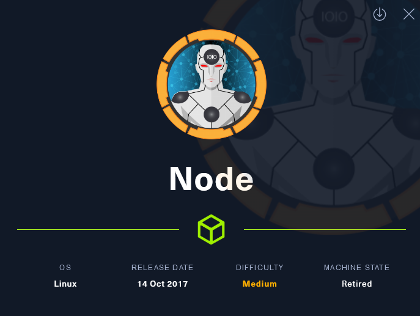
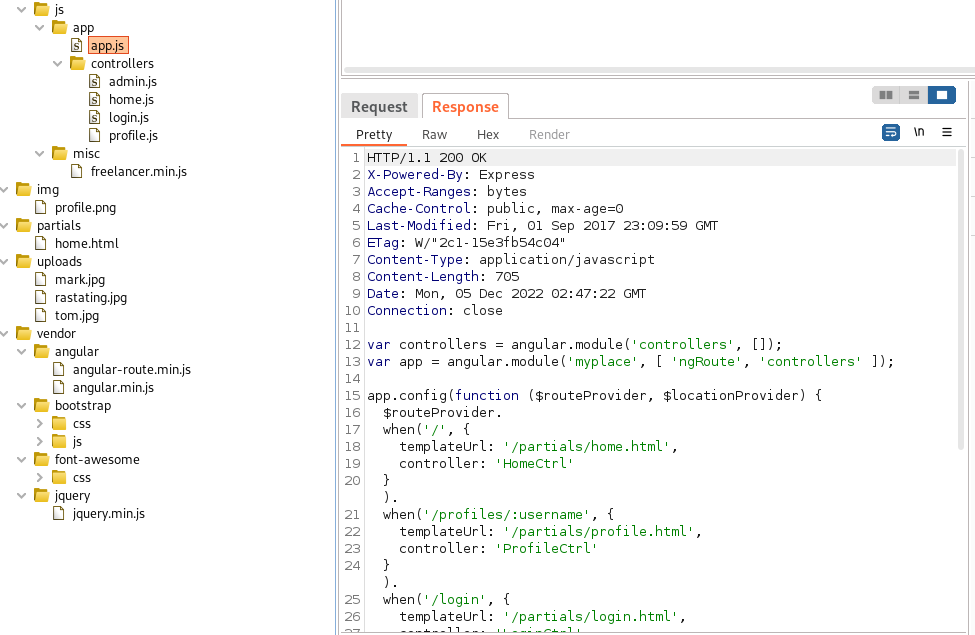
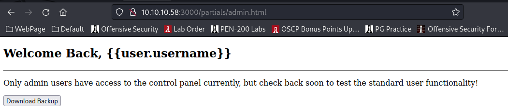
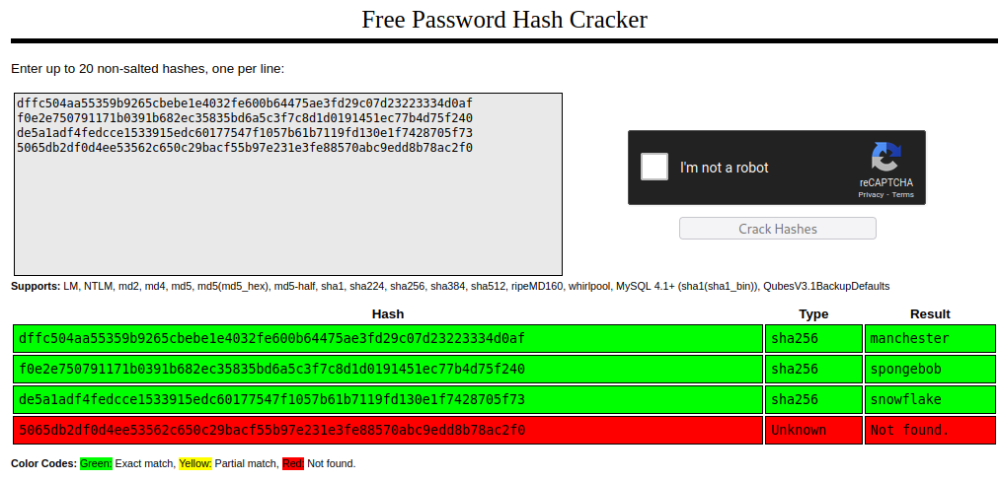

<button type="button" name="button" class="btn">#Hadoop </button>
<button type="button" name="button" class="btn">#CVE-2014-4688</button>
# Lessons Learned
# Enumeration
## NMap
Initially received 0 results, so we utilized the -Pn switch as suggested and can see that hadoop is running on port 3000:

```
nmap -sC -sV 10.10.10.58 -p-  
Starting Nmap 7.93 ( https://nmap.org ) at 2022-12-04 18:56 MST
Note: Host seems down. If it is really up, but blocking our ping probes, try -Pn
Nmap done: 1 IP address (0 hosts up) scanned in 3.38 seconds
```

```
nmap -sC -sV 10.10.10.58 -Pn
Starting Nmap 7.93 ( https://nmap.org ) at 2022-12-04 18:56 MST
Nmap scan report for 10.10.10.58
Host is up (0.066s latency).
Not shown: 998 filtered tcp ports (no-response)
PORT     STATE SERVICE         VERSION
22/tcp   open  ssh             OpenSSH 7.2p2 Ubuntu 4ubuntu2.2 (Ubuntu Linux; protocol 2.0)
| ssh-hostkey:
|   2048 dc5e34a625db43eceb40f4967b8ed1da (RSA)
|   256 6c8e5e5f4fd5417d1895d1dc2e3fe59c (ECDSA)
|_  256 d878b85d85ffad7be6e2b5da1e526236 (ED25519)
3000/tcp open  hadoop-datanode Apache Hadoop
|_http-title: MyPlace
| hadoop-datanode-info:
|_  Logs: /login
| hadoop-tasktracker-info:
|_  Logs: /login
Service Info: OS: Linux; CPE: cpe:/o:linux:linux_kernel

Service detection performed. Please report any incorrect results at https://nmap.org/submit/ .
Nmap done: 1 IP address (1 host up) scanned in 30.21 seconds
```

## Manual Review
Navigating to the IP and port 3000 we see a website with a login link there. I've created a 'user.txt' containing these 3 usernames for future if we get to brute forcing.
  

Poked at the login page with admin/admin, root/root, mark/password, etc as quick tests. Pasting this image so we have the failure verbiage for later:

## FFuF
Fuzzed our parent directory and came up with the following directory structure. I'm poking around each directory and their all redirecting back to the main page (obviously, 301s). I could continue fuzzing each directory, but I think we'll move on to using Burp Suite to try and spider the site. FFuF's always a good start, though. Maybe I'm just lazy.
```
ffuf -u http://10.10.10.58:3000/FUZZ -w /usr/share/wordlists/dirbuster/directory-list-2.3-medium.txt | grep -v 200

        /'___\  /'___\           /'___\       
       /\ \__/ /\ \__/  __  __  /\ \__/       
       \ \ ,__\\ \ ,__\/\ \/\ \ \ \ ,__\      
        \ \ \_/ \ \ \_/\ \ \_\ \ \ \ \_/      
         \ \_\   \ \_\  \ \____/  \ \_\       
          \/_/    \/_/   \/___/    \/_/       

       v1.5.0 Kali Exclusive <3
________________________________________________

 :: Method           : GET
 :: URL              : http://10.10.10.58:3000/FUZZ
 :: Wordlist         : FUZZ: /usr/share/wordlists/dirbuster/directory-list-2.3-medium.txt
 :: Follow redirects : false
 :: Calibration      : false
 :: Timeout          : 10
 :: Threads          : 40
 :: Matcher          : Response status: 200,204,301,302,307,401,403,405,500
________________________________________________

uploads                 [Status: 301, Size: 173, Words: 7, Lines: 10, Duration: 70ms]
assets                  [Status: 301, Size: 171, Words: 7, Lines: 10, Duration: 64ms]
vendor                  [Status: 301, Size: 171, Words: 7, Lines: 10, Duration: 70ms]
:: Progress: [220560/220560] :: Job [1/1] :: 505 req/sec :: Duration: [0:09:05] :: Errors: 0 ::
```
## Burp Suite
I already have FoxyProxy configured. If you haven't utilized Burp Suite before, I highly recommend installing this add-on as it will make turning your proxy on/off much easier.


Here's my FoxyProxy settings for the 'Burp' line-item:


Pretty easy. I started up Burp, turned on the FoxyProxy Burp setting, navigated to the site (http://10.10.10.58:3000), and selected "Proxy > Intercept" within Burp and forwarded all incoming packets. This built out a nice top-level view of the site (sometimes referred to as 'spidering' a site):


I'll bet you noticed this, too. There is a folder off of the main site: /api/users. I navigated there in the browser and, in plain text, we have the following print out of usernames and passwords. Passwords appear to be hashes of some sort, I don't recognize a pattern right out of the gate:
```java
0
_id	"59a7365b98aa325cc03ee51c"
username	"myP14ceAdm1nAcc0uNT"
password	"dffc504aa55359b9265cbebe1e4032fe600b64475ae3fd29c07d23223334d0af"
is_admin	true
1
_id	"59a7368398aa325cc03ee51d"
username	"tom"
password	"f0e2e750791171b0391b682ec35835bd6a5c3f7c8d1d0191451ec77b4d75f240"
is_admin	false
2
_id	"59a7368e98aa325cc03ee51e"
username	"mark"
password	"de5a1adf4fedcce1533915edc60177547f1057b61b7119fd130e1f7428705f73"
is_admin	false
3
_id	"59aa9781cced6f1d1490fce9"
username	"rastating"
password	"5065db2df0d4ee53562c650c29bacf55b97e231e3fe88570abc9edd8b78ac2f0"
is_admin	false
```
A bit further, into /latest, we also have the following 'hashes' (we'll call them for now):
```java
0
_id	"59a7368398aa325cc03ee51d"
username	"tom"
password	"f0e2e750791171b0391b682ec35835bd6a5c3f7c8d1d0191451ec77b4d75f240"
is_admin	false
1
_id	"59a7368e98aa325cc03ee51e"
username	"mark"
password	"de5a1adf4fedcce1533915edc60177547f1057b61b7119fd130e1f7428705f73"
is_admin	false
2
_id	"59aa9781cced6f1d1490fce9"
username	"rastating"
password	"5065db2df0d4ee53562c650c29bacf55b97e231e3fe88570abc9edd8b78ac2f0"
is_admin	false
```

Obviously, the item with 'admin' in the name is of most interest. Quick comparison just by looking, it appears our 3 primary users (Mark, Tom, and <s>Travis</s> Rastating) have the same password in each.  

For the remainder of burp suite discovery, note that I've switched to the 'Response' tab inside of the console to retrieve the results listed below. You could, alternatively, navigate to each of these manually, but Burp has done some of the heavy lifting for us.
Example:


Poking around at each discovery, we see a few .js  files. Namely in /assets/js/app/app.js this information seems useful, as it's pointing to some additional subdirectories that I'm not seeing otherwise:
```
var controllers = angular.module('controllers', []);
var app = angular.module('myplace', [ 'ngRoute', 'controllers' ]);

app.config(function ($routeProvider, $locationProvider) {
  $routeProvider.
    when('/', {
      templateUrl: '/partials/home.html',
      controller: 'HomeCtrl'
    }).
    when('/profiles/:username', {
      templateUrl: '/partials/profile.html',
      controller: 'ProfileCtrl'
    }).
    when('/login', {
      templateUrl: '/partials/login.html',
      controller: 'LoginCtrl'
    }).
    when('/admin', {
      templateUrl: '/partials/admin.html',
      controller: 'AdminCtrl'
    }).
    otherwise({
      redirectTo: '/'
    });

    $locationProvider.html5Mode(true);
});
```

I wanted to also gather what I'd seen under admin.js, since this seems pertinent. Although, when navigating to /api/admin/backup you do have to authenticate there, so this info not necessary quite yet.
```
var controllers = angular.module('controllers');

controllers.controller('AdminCtrl', function ($scope, $http, $location, $window) {
  $scope.backup = function () {
    $window.open('/api/admin/backup', '_self');
  }

  $http.get('/api/session')
    .then(function (res) {
      if (res.data.authenticated) {
        $scope.user = res.data.user;
      }
      else {
        $location.path('/login');
      }
    });
});
```
This seems useful, however, hitting the download button doesn't get us a response:



## Hashes
I don't immediately recognize the 'hashes' here, so I ran one through hash-identifier and it appears they are likely SHA-256:
```
hash-identifier                                                                  
   #########################################################################
   #     __  __                     __           ______    _____           #
   #    /\ \/\ \                   /\ \         /\__  _\  /\  _ `\         #
   #    \ \ \_\ \     __      ____ \ \ \___     \/_/\ \/  \ \ \/\ \        #
   #     \ \  _  \  /'__`\   / ,__\ \ \  _ `\      \ \ \   \ \ \ \ \       #
   #      \ \ \ \ \/\ \_\ \_/\__, `\ \ \ \ \ \      \_\ \__ \ \ \_\ \      #
   #       \ \_\ \_\ \___ \_\/\____/  \ \_\ \_\     /\_____\ \ \____/      #
   #        \/_/\/_/\/__/\/_/\/___/    \/_/\/_/     \/_____/  \/___/  v1.2 #
   #                                                             By Zion3R #
   #                                                    www.Blackploit.com #
   #                                                   Root@Blackploit.com #
   #########################################################################
--------------------------------------------------
 HASH: dffc504aa55359b9265cbebe1e4032fe600b64475ae3fd29c07d23223334d0af

Possible Hashs:
[+] SHA-256
[+] Haval-256

Least Possible Hashs:
[+] GOST R 34.11-94
[+] RipeMD-256
[+] SNEFRU-256
[+] SHA-256(HMAC)
[+] Haval-256(HMAC)
[+] RipeMD-256(HMAC)
[+] SNEFRU-256(HMAC)
[+] SHA-256(md5($pass))
[+] SHA-256(sha1($pass))
```

I used [crackstation](https://crackstation.net/) to quickly crack these. Looks like it found all but one:

## Logging in
Our strange admin username (myP14ceAdm1nAcc0uNT) has a password of 'machester' which we discovered from the crackstation results. Logging in as that user, we're presented with a 'Download Backup' button. We'll pull this down and see what it contains.


# Exploitation
# Privilege Escalation
