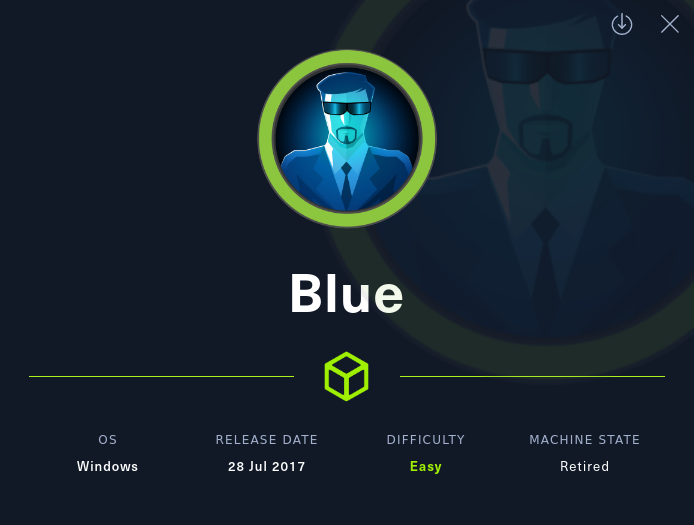

<button type="button" name="button" class="btn">#enum/smb</button>
<button type="button" name="button" class="btn">Win7 Pro SP1</button>
<button type="button" name="button" class="btn">CVE-2017-0143</button>
<button type="button" name="button" class="btn">Eternal Blue</button>

# Enumeration
---
## Machine Prep
I've set a shell variable of $ip to point to 10.10.10.4 to make my life a little easier:
```
ip=10.10.10.40
```

## NMAP
Fast NMAP Scan  
I am running this first in order to identify ALL open ports quickly - I will then run a more advanced scan, focusing on these specific ports, afterwards. I am trying to get into the habit of being more focused with my enumeration. 
{: .note }
```
nmap -T4 --min-rate 2000 -p- $ip
Starting Nmap 7.93 ( https://nmap.org ) at 2023-01-22 17:33 MST
Nmap scan report for 10.10.10.40
Host is up (0.063s latency).
Not shown: 65526 closed tcp ports (conn-refused)
PORT      STATE SERVICE
135/tcp   open  msrpc
139/tcp   open  netbios-ssn
445/tcp   open  microsoft-ds
49152/tcp open  unknown
49153/tcp open  unknown
49154/tcp open  unknown
49155/tcp open  unknown
49156/tcp open  unknown
49157/tcp open  unknown

Nmap done: 1 IP address (1 host up) scanned in 25.90 seconds
```

Full NMAP Scan  
```
nmap -sC -sV -p 135,139,445 $ip                                                                                                1 ⚙
Starting Nmap 7.93 ( https://nmap.org ) at 2023-01-22 17:34 MST
Nmap scan report for 10.10.10.40
Host is up (0.062s latency).

PORT    STATE SERVICE      VERSION
135/tcp open  msrpc        Microsoft Windows RPC
139/tcp open  netbios-ssn  Microsoft Windows netbios-ssn
445/tcp open  microsoft-ds Windows 7 Professional 7601 Service Pack 1 microsoft-ds (workgroup: WORKGROUP)
Service Info: Host: HARIS-PC; OS: Windows; CPE: cpe:/o:microsoft:windows

Host script results:
|_clock-skew: mean: 3s, deviation: 1s, median: 2s
| smb-os-discovery: 
|   OS: Windows 7 Professional 7601 Service Pack 1 (Windows 7 Professional 6.1)
|   OS CPE: cpe:/o:microsoft:windows_7::sp1:professional
|   Computer name: haris-PC
|   NetBIOS computer name: HARIS-PC\x00
|   Workgroup: WORKGROUP\x00
|_  System time: 2023-01-23T00:34:12+00:00
| smb2-time: 
|   date: 2023-01-23T00:34:15
|_  start_date: 2023-01-23T00:31:55
| smb2-security-mode: 
|   210: 
|_    Message signing enabled but not required
| smb-security-mode: 
|   account_used: guest
|   authentication_level: user
|   challenge_response: supported
|_  message_signing: disabled (dangerous, but default)

Service detection performed. Please report any incorrect results at https://nmap.org/submit/ .
Nmap done: 1 IP address (1 host up) scanned in 16.48 seconds
```

SMB seems to be a popular theme between all of our Windows Boxes!
We'll run with the assumption that this scan is accurate and will note that this box appears to be running: 
>{: .highlight }  
Windows 7 Pro 7601 SP1

## SMB
Continuing on with our SMB/SAMBA themed boxes. We'll run through some initial enumeration.  
SMBMap Doesn't produce any results (at this point I'm beginning to think that my syntax is incorrect, but this has worked elsewhere).
```
smbmap -H $ip                                                                                                            130 ⨯ 1 ⚙
[+] IP: 10.10.10.40:445 Name: 10.10.10.40 
```
I 'touch' SMB real quick with SMBClient to list out the shares:
```
smbclient -L \\\\$ip -U 'anonymous'                                                                                            1 ⚙
Password for [WORKGROUP\anonymous]:

        Sharename       Type      Comment
        ---------       ----      -------
        ADMIN$          Disk      Remote Admin
        C$              Disk      Default share
        IPC$            IPC       Remote IPC
        Share           Disk      
        Users           Disk      
Reconnecting with SMB1 for workgroup listing.
do_connect: Connection to 10.10.10.40 failed (Error NT_STATUS_RESOURCE_NAME_NOT_FOUND)
Unable to connect with SMB1 -- no workgroup available
```
I can connect to \Share, but it doesn't appear anything is there:
```
smbclient \\\\$ip\\Share -U 'anonymous'                                                                                        1 ⚙
Password for [WORKGROUP\anonymous]:
Try "help" to get a list of possible commands.
smb: \> dir
  .                                   D        0  Fri Jul 14 07:48:44 2017
  ..                                  D        0  Fri Jul 14 07:48:44 2017

                4692735 blocks of size 4096. 593130 blocks available
```
A few things under \Users:
```
smbclient \\\\$ip\\Users -U 'anonymous'                                                                                        1 ⚙
Password for [WORKGROUP\anonymous]:
Try "help" to get a list of possible commands.
smb: \> dir
  .                                  DR        0  Fri Jul 21 00:56:23 2017
  ..                                 DR        0  Fri Jul 21 00:56:23 2017
  Default                           DHR        0  Tue Jul 14 01:07:31 2009
  desktop.ini                       AHS      174  Mon Jul 13 22:54:24 2009
  Public                             DR        0  Tue Apr 12 01:51:29 2011

                4692735 blocks of size 4096. 593130 blocks available
```
I created a new file on my machine in the same directory entitled 'test.txt' and put some random text within. Navigated to Public\Documents and confirm that I have the ability to upload files here:
```
smb: \Public\Documents\> put test.txt
putting file test.txt as \Public\Documents\test.txt (0.1 kb/s) (average 0.1 kb/s)
smb: \Public\Documents\> dir
  .                                  DR        0  Sun Jan 22 17:47:50 2023
  ..                                 DR        0  Sun Jan 22 17:47:50 2023
  desktop.ini                       AHS      278  Mon Jul 13 22:54:24 2009
  test.txt                            A       20  Sun Jan 22 17:47:50 2023

                4692735 blocks of size 4096. 593351 blocks available
```
So we do have the ability to upload files via an anonymous session.
>{: .highlight }  
Anonymous File Upload

Testing with NMAP Scripts
```
nmap --script smb-vuln* $ip                                                                                                    1 ⚙
Starting Nmap 7.93 ( https://nmap.org ) at 2023-01-22 17:49 MST
Nmap scan report for 10.10.10.40
Host is up (0.066s latency).
Not shown: 991 closed tcp ports (conn-refused)
PORT      STATE SERVICE
135/tcp   open  msrpc
139/tcp   open  netbios-ssn
445/tcp   open  microsoft-ds
49152/tcp open  unknown
49153/tcp open  unknown
49154/tcp open  unknown
49155/tcp open  unknown
49156/tcp open  unknown
49157/tcp open  unknown

Host script results:
|_smb-vuln-ms10-054: false
| smb-vuln-ms17-010: 
|   VULNERABLE:
|   Remote Code Execution vulnerability in Microsoft SMBv1 servers (ms17-010)
|     State: VULNERABLE
|     IDs:  CVE:CVE-2017-0143
|     Risk factor: HIGH
|       A critical remote code execution vulnerability exists in Microsoft SMBv1
|        servers (ms17-010).
|           
|     Disclosure date: 2017-03-14
|     References:
|       https://technet.microsoft.com/en-us/library/security/ms17-010.aspx
|       https://blogs.technet.microsoft.com/msrc/2017/05/12/customer-guidance-for-wannacrypt-attacks/
|_      https://cve.mitre.org/cgi-bin/cvename.cgi?name=CVE-2017-0143
|_smb-vuln-ms10-061: NT_STATUS_OBJECT_NAME_NOT_FOUND

Nmap done: 1 IP address (1 host up) scanned in 16.18 seconds
```
Well - looks like this machine is vulnerable to Eternal Blue - which we should have already figured out from the machine name, right? ;)
>{: .highlight }  
Eternal blue